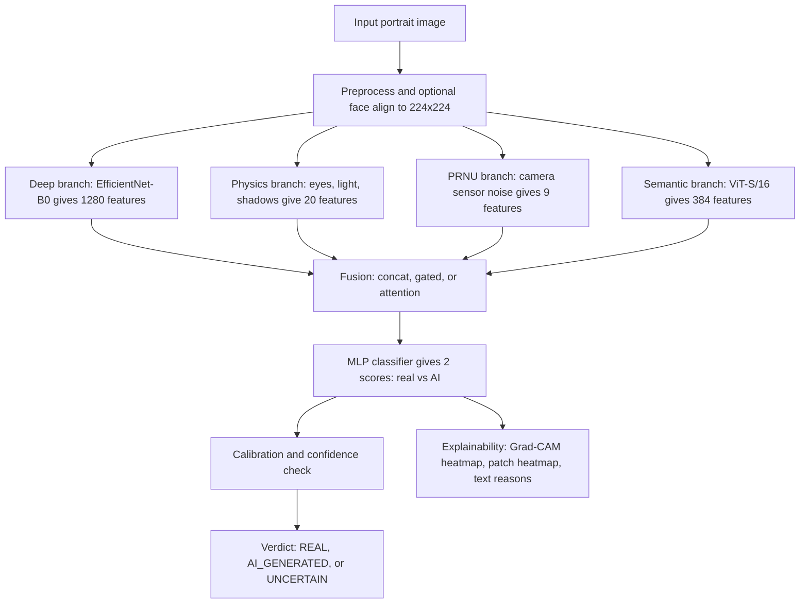
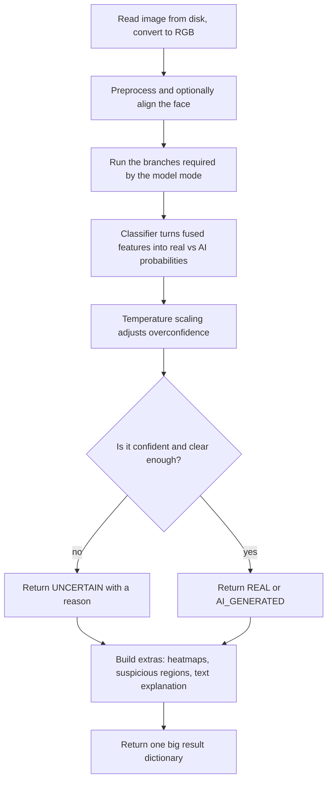
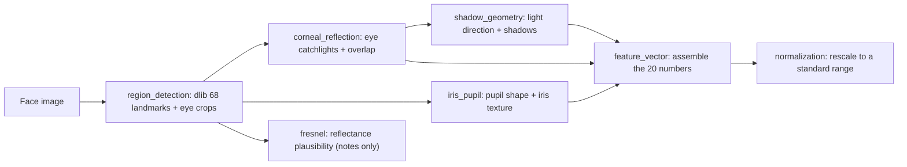
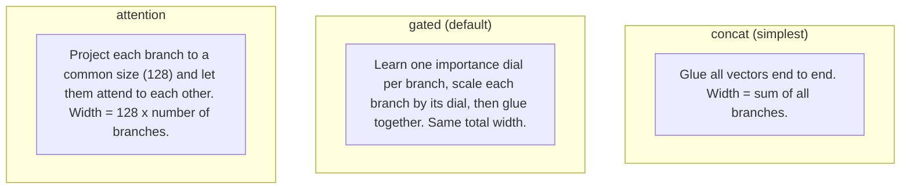
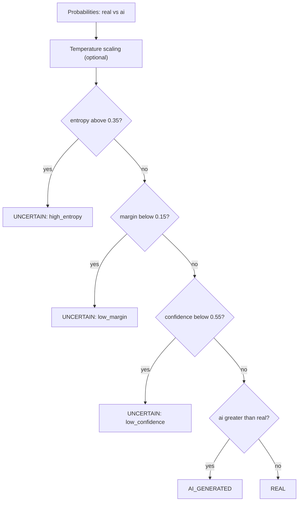
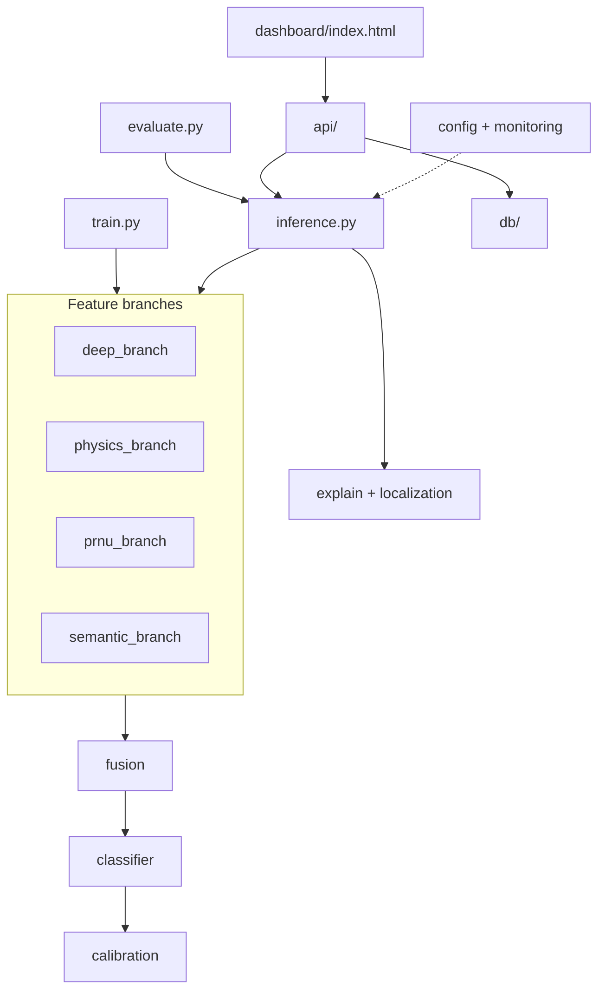

# AI vs Real Face Detector — Project Architecture

This document explains how the whole project is put together, in plain language. It walks through the big picture first, then describes what every folder and file actually does, and finishes with the important design decisions, known bugs, and how to run things.

If you only read one section, read **"The big idea"** and look at the **first diagram**. Everything else is detail.

---

## 1. What this project does

You give it a **portrait photo**. It tells you whether the face is a **real photograph** or an **AI-generated / fake** image — or says **"uncertain"** when it isn't confident enough to commit.

It is described in the code as a **research prototype**, not a courtroom-grade forensic tool. Its answers depend heavily on which AI generators it was trained against, the quality of the photo, and which trained model file (checkpoint) you load.

---

## 2. The big idea: many small experts, one careful judge

Instead of trusting a single neural network, the system asks **four independent "experts" (called branches)** to each look at the image and produce a list of numbers (a "feature vector"). A **fusion** step combines those numbers, a small **classifier** turns them into a real-vs-AI score, and finally a cautious **judge** (the calibration step) decides whether the score is trustworthy enough to give a verdict.

The four experts are:

| Branch | What it looks at | Numbers it produces |
|---|---|---|
| **Deep** | The overall look of the face, learned by a big pretrained network (EfficientNet-B0) | 1280 |
| **Physics** | Do the eyes, reflections, light and shadows obey real-world optics? | 20 |
| **PRNU** | The invisible "sensor noise fingerprint" a real camera leaves behind | 9 |
| **Semantic** | High-level "does this look normal?" judgment from a Vision Transformer (ViT) | 384 |

The reason for this design is defensibility: a fake image might fool the deep network, but it also has to fake correct eye reflections, correct camera noise, *and* look normal to the ViT. Each expert can fail independently, which makes the combined system harder to trick.

---

## 3. High-level architecture



Not every branch is always used. Which experts speak depends on the **mode** of the loaded model (see section 5). The physics branch is used in `hybrid` and `full_hybrid`; PRNU and semantic are only used in `full_hybrid`.

---

## 4. What happens when you analyze one image

This is the end-to-end flow inside `src/inference.py` when you call `predict(...)`:



The final result is a single Python dictionary containing the label, confidence, probability split, a Grad-CAM heatmap image (base64), physics features, PRNU info, fusion weights, a plain-English explanation, and more. The API and dashboard read fields out of this dictionary.

---

## 5. The three model "modes"

The same code can run three increasingly powerful configurations. The mode is stored **inside the checkpoint file** and read back at load time.

| Mode | Experts used | Fusion input width | Typical checkpoint | Status |
|---|---|---|---|---|
| `stage1` | Deep only | 1280 | `stage1_best.pt` | Image-only baseline. **Training path is currently broken — see section 11.** |
| `hybrid` | Deep + Physics | 1280 + 20 = 1300 | `hybrid_best.pt` | The older "legacy" two-input model. |
| `full_hybrid` | Deep + Physics + PRNU + Semantic | 1280 + 20 + 9 + 384 = **1693** (concat/gated) or 512 (attention) | `full_hybrid_best.pt` | The main, current model. Trained by the Run 2 notebooks. |

---

## 6. Repository map

```text
ai-vs-real-face-detector/
├── README.md                     Human-facing overview and how-to
├── EVALUATION.md                 How to run the evaluator
├── PROJECT_ARCHITECTURE.md       (this file)
├── requirements.txt              Python dependencies
├── src/
│   ├── train.py                  Training entry point (Colab/Kaggle GPU)
│   ├── inference.py              Single-image prediction (the hub)
│   ├── evaluate.py               Metrics, plots, data-leakage report, ablations
│   ├── deep_branch/              EfficientNet + preprocessing + face alignment
│   ├── physics_branch/           Eyes, reflections, light, shadows (20 features)
│   ├── prnu_branch/              Camera sensor-noise features (9 features)
│   ├── semantic_branch/          ViT embeddings + attention maps (384 features)
│   ├── fusion/                   Combine the branches (concat / gated / attention)
│   ├── classifier/              The MLP head + ablation catalog
│   ├── calibration/             Confidence, uncertainty, REAL/AI/UNCERTAIN decision
│   ├── features/                Fit the physics/PRNU normalizers on training data
│   ├── explain/                 Grad-CAM heatmaps + text explanations
│   ├── localization/            Patch-level "where is it suspicious" heatmap
│   ├── config/                  YAML settings + typed config models
│   ├── monitoring/              Logging
│   ├── api/                     FastAPI web service
│   ├── db/                      PostgreSQL storage of predictions
│   └── scripts/                 Local debug tools
├── tests/                        Pytest unit + integration tests
├── notebooks/                    Run 2 dataset prep + Colab training notebooks
├── dashboard/                    Single-file web UI for uploading a photo
├── docker/                       Dockerfile + docker-compose (API + Postgres)
├── data/                         Dataset folders (mostly empty placeholders here)
├── models/                       Where trained checkpoints are saved
└── evaluation_outputs/           Metrics, plots, and reports from evaluate.py
```

---

## 7. File-by-file walkthrough

Every source file is described below, grouped by module. Class and function names are shown `like this`.

### 7.1 Entry points and orchestration

**`src/train.py`** — The training program (the biggest file, ~2,300 lines). You run it from the command line to train a model on a GPU (it explicitly warns it is meant for Colab/Kaggle, not a small local machine).

- It defines `FaceBinaryDataset`, which finds images under `real/` and `fake/` folders (label 0 = real, 1 = fake). If a nested folder like `fake/stylegan2/` exists, that name is recorded as the image's "source". It supports two layouts: an explicit `train/val/test` split, or a legacy folder it splits deterministically by a saved random seed.
- For each image it produces the features each branch needs. Importantly, the **physics and PRNU normalizers are fitted only on the training images** (via `fit_physics_and_prnu_scalers`) so the model never "peeks" at validation/test data.
- It builds the right model for the chosen `--mode`, then runs a standard loop: `CrossEntropyLoss`, the `AdamW` optimizer, and a `CosineAnnealingLR` schedule. After each epoch it saves a "last" checkpoint and, when validation accuracy improves, a "best" checkpoint.
- Each saved checkpoint bundles the model weights, optimizer/scheduler state, the exact command-line arguments (including the seed), and — for `full_hybrid` — the fitted normalizer statistics. `full_hybrid` can also resume after an interruption and runs a final evaluation on the held-out test set.
- Key command-line flags: `--mode`, `--data-dir`, `--output-dir`, `--backbone`, `--freeze-blocks`, `--semantic-model`, `--semantic-dim`, `--fusion-mode` (concat/gated/attention), `--epochs`, `--batch-size`, `--lr`, `--weight-decay`, `--seed`, and `--allow-cpu` (for smoke tests only).

**`src/inference.py`** — The prediction hub used by everything else (the API, the evaluator, the tests). Its `predict(...)` function does the full image-to-verdict flow from section 4.

- It keeps a **cache** (`_MODEL_CACHE`) so each checkpoint is loaded into memory only once per device, which makes repeated predictions fast. `load_model(...)` reads the checkpoint, looks at its stored `"mode"` field to decide which model class to build, and loads the weights.
- It runs only the branches the mode needs, applies **temperature scaling** and the **uncertainty decision** (via the calibration module), then assembles the big result dictionary — including the Grad-CAM heatmap, ViT attention map, patch-level "suspicious regions", and a text explanation when full explainability is requested.
- Note: in `hybrid` mode the reported fusion weights are a fixed 50/50 placeholder; only `full_hybrid` computes real per-branch weights.

**`src/evaluate.py`** — Measures how good a checkpoint is, without training. It picks a test set (a real `data/test/` folder if present, otherwise it re-creates the checkpoint's own held-out split using the saved seed), runs the model, and writes out `metrics.json` (accuracy, precision, recall, F1, specificity, ROC-AUC, confusion counts, calibration error), a `predictions.csv`, plots (confusion matrix, ROC, precision-recall), and a **data-leakage report**. The leakage report compares SHA-256 file hashes to catch images that are byte-for-byte identical between train and test (it does **not** catch resized or re-saved near-duplicates). Note: the `hybrid` path here uses the older two-input model call, and the `--ablation` sub-command is currently broken (see section 11).

### 7.2 The Deep branch — `src/deep_branch/`

This branch is the "gut instinct" expert: a large image network that has learned what faces look like.

**`feature_extractor.py`** — Builds the backbone with `timm.create_model("efficientnet_b0", num_classes=0, global_pool="avg")`, which strips the network's own classifier and returns a **1280-number summary** of the image. `DeepFeatureExtractor` produces just those features (and can freeze the earliest layers so training is faster and more stable); `DeepClassifier` adds a small 2-class head and is used as the standalone `stage1` model.

**`preprocessing.py`** — Turns a raw image into the exact tensor the network expects: convert to RGB, optionally align/crop the face, resize to 224×224, and normalize using the standard ImageNet mean/std. `get_train_transforms()` adds light data augmentation (random flip, mild color jitter); `get_val_transforms()` does not. Optional heavier cleanups (noise reduction, contrast enhancement) exist but are off by default for speed.

**`face_align.py`** — Detects the face and rotates/scales it to a canonical position (eyes and mouth in standard spots) before it reaches the network, which improves consistency. It gets its landmarks from the physics branch's dlib detector, derives 5 key points (eyes, nose, mouth corners), and warps the image onto a standard template. If no face is found it just resizes the whole image and reports `no_face`; if landmarks are too sparse it falls back to a simple padded crop.

**`__init__.py`** — Package wiring. It exposes the preprocessing helpers immediately but loads the heavy model classes only when first used (a lazy-import trick to keep imports cheap).

### 7.3 The Physics branch — `src/physics_branch/`

This is the most distinctive expert: it checks whether the face obeys real-world optics. It runs as a small pipeline and outputs exactly **20 numbers**.



**`region_detection.py`** — The foundation of the branch (~800 lines). It uses **dlib's** HOG face detector plus the classic **68-point facial-landmark model** (`shape_predictor_68_face_landmarks.dat`, auto-downloaded on first use to a local cache). From the landmarks it isolates each eye and produces a `FaceLandmarks` object. If no face is found it returns a result marked `detected = False`, and the rest of the branch degrades gracefully. Important caveat: the 68-point model has no iris/pupil points, so the code **approximates** them as a small circle around each eye's center — everything "iris/pupil" downstream rests on that approximation. (This file replaced an older MediaPipe detector that caused a threading deadlock during training.)

**`corneal_reflection.py`** — Finds the bright pinpoint reflection (the "catchlight") in each eye. In a real photo, both eyes are lit by the same environment, so the two catchlights should match. It detects each highlight, mirrors the right eye onto the left, and measures the overlap (IoU). Low overlap is suspicious.

**`iris_pupil.py`** — Fits an ellipse to each pupil (real pupils are close to circular) and measures the texture richness (entropy) of the iris. It reports how round the pupils are, how different the two pupils are from each other, and how detailed the iris texture is — AI images sometimes get these subtly wrong.

**`shadow_geometry.py`** — Estimates the direction light is coming from (using each eye's catchlight) and analyzes shadows across the face. If the two eyes imply light from different directions, or the face's shadows are lopsided, that's a red flag. It outputs an angle difference, a similarity score, and a consistency flag.

**`fresnel.py`** — Computes the physics of how much light a real cornea should reflect at a given angle (the Fresnel equations, using a cornea refractive index of 1.376). This is used **only as explainability metadata** — it is deliberately **not** one of the 20 classifier features — so it can describe plausibility without the model leaning on a heuristic.

**`feature_vector.py`** — The assembler. It runs the sub-analyses above and packs the results into the fixed, ordered **20-feature vector** (`PHYSICS_FEATURE_DIM = 20`). The 20 features are:

| # | Feature | Plain meaning |
|---|---|---|
| 0 | `face_detected` | Was a face found at all (1/0) |
| 1 | `highlight_iou` | Overlap of the two eye catchlights |
| 2 | `highlight_consistent` | Is that overlap good enough (1/0) |
| 3 | `highlight_offset_x` | Horizontal mismatch of the catchlights |
| 4 | `highlight_offset_y` | Vertical mismatch of the catchlights |
| 5 | `left_pupil_eccentricity` | How stretched the left pupil is |
| 6 | `right_pupil_eccentricity` | How stretched the right pupil is |
| 7 | `pupil_eccentricity_diff` | Difference in pupil shape between eyes |
| 8 | `pupil_regularity_mean` | How round the pupils are on average |
| 9 | `left_iris_entropy` | Left iris texture richness |
| 10 | `right_iris_entropy` | Right iris texture richness |
| 11 | `iris_entropy_mean` | Average iris texture richness |
| 12 | `iris_entropy_diff` | Left/right iris texture mismatch |
| 13 | `light_angle_diff_deg` | Disagreement between the eyes on light direction |
| 14 | `light_cosine_similarity` | Agreement between the eyes' light vectors |
| 15 | `light_consistent` | Is the lighting consistent (1/0) |
| 16 | `left_highlight_detected` | Was a left catchlight found (1/0) |
| 17 | `right_highlight_detected` | Was a right catchlight found (1/0) |
| 18 | `left_pupil_detected` | Was a left pupil fit (1/0) |
| 19 | `right_pupil_detected` | Was a right pupil fit (1/0) |

**`normalization.py`** — Rescales each of the 20 features to a standard range (z-scoring: subtract the mean, divide by the standard deviation) so no single feature dominates. `PhysicsNormalizer` ships with sensible default statistics but is normally **fitted on the training data** and saved inside the checkpoint. It has no file of its own — it saves/loads itself as a plain dictionary via `to_dict()` / `from_dict()`.

### 7.4 The PRNU branch — `src/prnu_branch/`

**`extractor.py`** — PRNU stands for "Photo-Response Non-Uniformity" — the faint, unique noise pattern a real camera sensor stamps into every photo. This file estimates that noise by subtracting a denoised copy of the image from the original (`cv2.fastNlMeansDenoising`), then computes **9 statistics** about the leftover noise (mean, standard deviation, skew, kurtosis, energy, spatial autocorrelation, high-frequency ratio, an overall `prnu_score`, and a reliability flag). Without a reference photo from the actual camera, it can only report **"limited"** reliability — it's a supporting hint, not proof.

### 7.5 The Semantic branch — `src/semantic_branch/`

**`encoder.py`** — Uses a **frozen** Vision Transformer (`vit_small_patch16_224`) as a second, higher-level opinion, producing a **384-number** embedding of the image. It never trains (all weights frozen), so it acts as a stable "does this look like a normal image?" signal. It also tries to produce an attention heatmap showing where the ViT "looked"; in practice the true-attention path usually can't be captured on modern ViTs, so it quietly falls back to an **occlusion map** (it hides one patch at a time and sees how much the output changes — accurate but ~196 extra passes per image).

### 7.6 Fusion — `src/fusion/`

**`fuse.py`** — Combines the branch feature vectors into one. `FusionMode` offers three strategies:



`concatenate_features(...)` handles the plain gluing; `FeatureFusion` wraps all three modes and can also report how much weight each branch received (`get_fusion_weights`). For `full_hybrid`, concat and gated both produce a width of **1693**; attention produces **512** (128 × 4 branches). The default is **gated**.

### 7.7 Classifier — `src/classifier/`

**`head.py`** — The final decision network and the two end-to-end models. `ClassificationHead` is a small stack of `Linear → BatchNorm → ReLU → Dropout` layers ending in **2 outputs** (real vs AI). `HybridClassifier` wires together the deep + physics branches (the legacy two-input model). `FullHybridClassifier` wires together all four branches with configurable fusion, and exposes `set_feature_scalers(...)` so the training-fitted normalizers can be injected at inference time. Both models return `(logits, deep_features)` — the extra deep features are reused by the explainability tools.

**`ablation.py`** — A catalog, not a computation. It lists the branch on/off combinations (deep-only, physics-only, deep+physics, deep+physics+PRNU, deep+physics+ViT, and full) so experiments can measure how much each branch actually contributes.

### 7.8 Calibration and the final decision — `src/calibration/`

**`calibrator.py`** — This is the cautious "judge". It contains:

- `ProbabilityCalibrator` — **temperature scaling**, which softens or sharpens the model's confidence so a "90%" really means 90%. It can also fit the best temperature on validation data by a simple grid search.
- `UncertaintyEstimator` — turns probabilities into a final `LabelDecision` of **REAL**, **AI_GENERATED**, or **UNCERTAIN**, using three gates checked in order:



- `calibration_metrics(...)` — reports how well-calibrated the model is (Expected and Maximum Calibration Error). The three thresholds (0.35 / 0.15 / 0.55) come from `config.yaml`, so you can tune how cautious the system is without touching code.

### 7.9 Feature scalers — `src/features/`

**`feature_scalers.py`** — Contains `fit_physics_and_prnu_scalers(...)`, which `train.py` calls to learn the normalization statistics for the physics and PRNU features. To keep it fast, it fits on a deterministic sample of up to 300 training images (enough for stable mean/std). Crucially it is fed **only training image paths**, which is what keeps validation and test data from leaking into the model.

### 7.10 Explainability — `src/explain/` and `src/localization/`

**`explain/gradcam.py`** — Produces a **Grad-CAM heatmap**: a colored overlay showing which parts of the image most influenced the "real vs AI" decision. It targets a late layer of the EfficientNet backbone. Because Grad-CAM only works on the image, the physics/PRNU/semantic inputs are held fixed while it runs. Output is a base64 PNG the dashboard can display directly.

**`explain/explanation.py`** — `generate_explanation(...)` writes a short, honest, human-readable paragraph from the actual outputs: the verdict and confidence, why something was marked uncertain, what the physics checks found (eye reflections, lighting, iris texture), and a note that PRNU evidence is "limited" when there's no reference camera. It deliberately never invents evidence.

**`localization/patch_scorer.py`** — Answers "**where** does it look fake?" It splits the image into a 7×7 grid, scores each tile's AI-probability, and builds a smooth heatmap plus a list of the top suspicious regions. (One caveat: the physics vector is not recomputed per tile, so only the deep branch truly varies across the grid.)

### 7.11 Configuration — `src/config/`

**`__init__.py`** — Defines typed settings objects (using Pydantic) for the model, inference thresholds, physics thresholds, database, API, logging, and alerts, and loads them from `config.yaml` via a cached `get_config()`.

**`config.yaml`** — The actual settings file: which checkpoint to load, the confidence/uncertainty/margin thresholds, the temperature, the database URL, the API's upload size limit and CORS policy, and logging options. This is the main knob-board for running the system.

### 7.12 Monitoring — `src/monitoring/`

**`logger.py`** — Sets up one shared logger that writes both to the screen and to `logs/app.log`, plus small helpers to time operations and to log each prediction. It reads its level and file path from the config.

### 7.13 Serving: the web API — `src/api/`

**`main.py`** — Creates the FastAPI application: sets up logging, applies CORS, connects to the database, **loads the model once at startup**, mounts the API routes under `/api/v1`, and serves the dashboard at `/dashboard/`.

**`routes.py`** — Defines the endpoints and all the input validation (allowed image formats, max file size, min/max dimensions). It reuses the single loaded model for every request.

| Method + path | What it does |
|---|---|
| `GET /api/v1/health` | Reports whether the model is loaded, its version, and architecture |
| `POST /api/v1/predict` | Accepts an uploaded image, runs `inference.predict`, saves the result to the database, and returns the full verdict |
| `GET /api/v1/predictions` | Lists recent stored predictions (newest first) |
| `GET /api/v1/predictions/{prediction_id}` | Fetches one stored prediction by its ID |

**`schemas.py`** — The Pydantic models that define the exact JSON shapes of requests and responses (e.g. `PredictionResponse`, `ProbabilityDistribution`, `PRNUInfo`, `HealthResponse`), so the API is self-documenting and validated.

### 7.14 Serving: the database — `src/db/`

**`models.py`** — Defines a single SQLAlchemy table, `predictions`, with columns for the id, timestamp, filename, label, confidence, both class probabilities, model version, an optional base64 heatmap, and an optional error message. Creating a session factory also auto-creates the table.

**`crud.py`** — The small set of database operations: `create_prediction` (save one result), `get_prediction` (fetch by id), and `list_predictions` (recent list). It is create-and-read only; there are no update/delete operations.

### 7.15 The dashboard — `dashboard/index.html`

A single self-contained web page ("tringtring Forensics") with a dark theme and no build step. You drag-and-drop or select a portrait, it POSTs the file to `/api/v1/predict`, then shows the verdict badge, the confidence and real/AI split, the original image next to the Grad-CAM heatmap, and three "evidence cards" summarizing the physics checks (corneal reflection, pupil/iris shape, light direction). It only uses the `/predict` endpoint and only reads a handful of fields from the response.

### 7.16 Deployment — `docker/`

**`Dockerfile`** — Builds one image on Python 3.11-slim, installs the native libraries needed by OpenCV/dlib, installs the Python requirements, copies the code, and runs the API with uvicorn on port 8000.

**`docker-compose.yml`** — Brings up two containers: the **app** (the FastAPI service, in dev mode with hot-reload and the source folder mounted in) and a **PostgreSQL** database, wired together so the app waits for the database to be healthy before starting. It sets the database URL and uses default `postgres/postgres` credentials (fine for local dev, not for production).

### 7.17 Tests — `tests/`

Thirteen `pytest` files plus a `conftest.py` that puts the repo root on the import path. The suite covers the deterministic, CPU-friendly parts well: the physics branch (reflection detection, IoU, Fresnel, shadows, pupil fitting, the 20-feature vector), all three fusion modes, calibration and the REAL/AI/UNCERTAIN decision, PRNU features, preprocessing and face alignment, the explanation text, the API response schema, and the evaluator's metrics + leakage detection. The end-to-end inference tests **skip themselves** if no trained checkpoint or sample images are present, so a clean checkout runs the rest without needing a model. Lightly covered: the training loop itself, the raw network forward passes, Grad-CAM generation, and the live API server.

| Test file | Focuses on |
|---|---|
| `test_physics_branch.py` | Reflection/IoU, highlight detection, pupil ellipse, 20-feature vector, no-face handling |
| `test_fresnel.py` | Fresnel reflectance at normal vs grazing angles |
| `test_fusion.py` / `test_fusion_extended.py` | Concatenation and the gated/attention output shapes |
| `test_calibration.py` | Temperature scaling, uncertainty decision, calibration error |
| `test_prnu.py` | 9-feature PRNU output and reliability states |
| `test_preprocessing.py` / `test_face_align.py` | Tensor shapes, RGB handling, alignment |
| `test_explanation.py` | Text explanation content |
| `test_inference_api.py` | Response schema + the model cache |
| `test_evaluate.py` | Metric math + leakage detection |
| `test_e2e_inference.py` | Full predict on a real checkpoint (skips if absent) |

### 7.18 Notebooks — `notebooks/`

**`dataset_prep_RUN2_combined.ipynb`** — Builds the "Run 2" dataset in Google Colab: it gathers **5,000 real** faces (FFHQ) and **5,000 fakes** (StyleGAN2 plus two Stable-Diffusion sources from the DeepFakeFace dataset), balances them, splits them **70/15/15** into train/val/test while keeping each generator represented in every split, copies them into the `data/train|val|test/{real,fake}` layout, and writes reproducibility manifests.

**`train_colab_RUN2_combined.ipynb`** — Trains the `full_hybrid` model on a GPU: it checks for a GPU, clones the repo, installs dependencies, verifies the dataset, runs a quick one-epoch smoke test, then a 15-epoch run with gated fusion, and finally reports the held-out test metrics and downloads the checkpoint.

### 7.19 Stray and generated files

**`1.4.0`** — Not code. It's an accidentally captured **pip install log** (console output redirected into a file named `1.4.0`). Safe to delete and add to `.gitignore`.

**`evaluation_outputs/data_leakage_report.txt`** — A generated report from a past evaluation run. Note it shows "Training images checked: 0", meaning the training set wasn't present that run, so its "no overlap found" conclusion is vacuous and shouldn't be cited as proof of a clean split until re-run.

**`logs/app.log`**, **`models/.gitkeep`**, **`data/.../​.gitkeep`**, **`Microsoft/…​/ModuleAnalysisCache`** — Runtime/log output, empty-folder placeholders, and a stray Windows PowerShell cache file (also safe to remove).

---

## 8. How the pieces depend on each other



The golden rule the code follows: the **model/feature core never imports the web framework**. The API depends on inference, but inference and the branches know nothing about FastAPI — so the "brains" of the system can be tested and reused on their own.

---

## 9. Feature-dimension cheat-sheet

| Branch | Feature count | Produced by |
|---|---|---|
| Deep (EfficientNet-B0) | 1280 | `deep_branch/feature_extractor.py` |
| Physics | 20 | `physics_branch/feature_vector.py` |
| PRNU | 9 | `prnu_branch/extractor.py` |
| Semantic (ViT-S/16) | 384 | `semantic_branch/encoder.py` |
| **Full hybrid fused (concat/gated)** | **1693** | `fusion/fuse.py` |
| Full hybrid fused (attention) | 512 | `fusion/fuse.py` |
| Final output classes | 2 (real, AI) | `classifier/head.py` |

---

## 10. Key design decisions (and why)

The system uses **multiple independent experts** rather than one network so that a fake has to defeat several unrelated checks at once. The **physics branch is kept separate and hand-built** so its reasoning is explainable and can't be silently overwhelmed by the deep network. The **semantic ViT is frozen** so it provides a stable second opinion instead of overfitting. **Normalizers are fitted on training data only** and stored inside the checkpoint, which prevents data leakage and keeps inference reproducible. A **cautious judge** (calibration + uncertainty gates) means the system says "uncertain" instead of guessing when signals are weak. And the **feature core is deliberately independent of the web layer**, so the important logic stays testable on its own.

---

## 11. Known limitations, gaps, and bugs

Several of these are noted in the README; the ones marked **confirmed in code** were verified while writing this document.

- **`stage1` training is broken (confirmed in code).** In `train.py`, `run_stage1` calls `train_epoch_full_hybrid(...)` with missing required arguments (and that helper expects PRNU/semantic data a stage1 batch doesn't have). It will crash on the first epoch. The correct helper `train_epoch_stage1` exists but is never called. `hybrid` and `full_hybrid` training are fine.
- **The evaluator's `--ablation` mode is broken (confirmed in code).** `run_ablation` calls `_dataset_for_evaluation(...)` with one too few arguments and raises an error. Normal (non-ablation) evaluation works.
- **`evaluate.py` targets the legacy models.** It evaluates `stage1`/`hybrid` cleanly but was not fully updated for `full_hybrid` PRNU+semantic checkpoints; for those, rely on the held-out test evaluation that `train.py` runs automatically.
- **PRNU is a weak signal without a reference camera** and always reports "limited" reliability. There is also a likely mislabeling in its high-frequency calculation (no FFT shift), so treat the PRNU numbers as soft hints.
- **The ViT "attention" map is usually an occlusion map.** The real attention weights typically can't be captured, so it silently falls back to a slower occlusion-based heatmap.
- **Iris/pupil features rest on an approximation.** The dlib 68-point model has no iris landmarks, so those points are estimated geometrically.
- **Version numbers disagree** across `src/__init__.py` (0.1.0), the config default (0.1.0), and `config.yaml` (0.2.0).
- **Security posture is dev-grade.** CORS defaults to fully open, there is no authentication or rate limiting, uploads aren't malware-scanned, the container runs as root, and the database uses default credentials. Checkpoints are loaded with Python pickle, so **only load checkpoints you trust**.
- **Housekeeping.** The stray `1.4.0` pip log, the `Microsoft/` PowerShell cache, and the vacuous leakage report should be cleaned up and git-ignored.

---

## 12. How to run it (quick reference)

```powershell
# Install
python -m venv venv
.\venv\Scripts\Activate.ps1
pip install -r requirements.txt
pytest tests -v

# Train (GPU; Colab/Kaggle recommended) — the working modes:
python src/train.py --mode hybrid      --data-dir data --output-dir models --epochs 15 --batch-size 32
python src/train.py --mode full_hybrid --data-dir data --output-dir models/run2_full_hybrid --epochs 15 --batch-size 16 --fusion-mode gated

# Predict on one image
python src/inference.py path\to\face.jpg --checkpoint models\full_hybrid_best.pt

# Evaluate a checkpoint (non-ablation)
python src/evaluate.py --checkpoint models\hybrid_best.pt --data-dir data

# Serve the API + dashboard
uvicorn src.api.main:app --host 0.0.0.0 --port 8000
#   API docs:   http://localhost:8000/docs
#   Dashboard:  http://localhost:8000/dashboard/

# Or run the whole stack (API + PostgreSQL) in containers
cd docker
docker compose up --build
```

---

*This document describes the code as it currently stands, including its rough edges, so a new contributor can get oriented quickly. For usage-focused instructions see `README.md`; for evaluation specifics see `EVALUATION.md`.*
