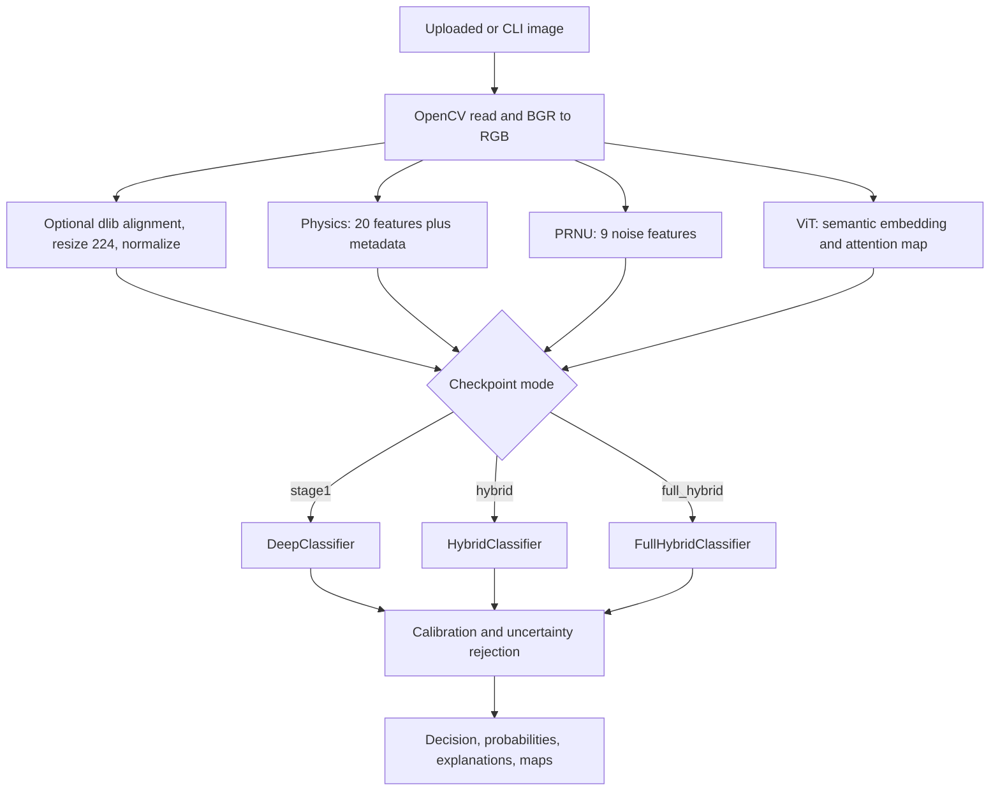

# AI vs Real Face Detector: Technical Documentation

> Reverse-engineered from the repository currently present at `C:\tringtring\ai-vs-real-face-detector`.
> Last inspected: August 24, 2026.

## 1. Project status

This is a research and education prototype for binary face-image authenticity classification. Class index `0` is `real`; class index `1` is `ai`. The runtime can additionally return `UNCERTAIN` when calibrated confidence, entropy, or class margin fails configured thresholds.

The project has three training modes. `stage1` is image-only, `hybrid` is image plus physics, and `full_hybrid` is a four-modality model using EfficientNet, physics, PRNU, and ViT semantic features. The repository does not contain the training dataset or a guaranteed trained checkpoint; those are produced externally, especially by the Run 2 Colab notebooks.

## 2. Repository map

| Area | Main files | Responsibility |
|---|---|---|
| Training | `src/train.py` | Dataset loading, three modes, checkpointing, metrics |
| Deep branch | `src/deep_branch/feature_extractor.py` | timm EfficientNet embedding and image-only classifier |
| Preprocessing | `src/deep_branch/preprocessing.py` | RGB conversion, optional alignment, resize, transforms |
| Alignment | `src/deep_branch/face_align.py` | dlib detection, five-point alignment, fallback crop |
| Physics | `src/physics_branch/` | Landmarks, highlights, Fresnel, iris/pupil, shadows |
| PRNU | `src/prnu_branch/extractor.py` | Denoising residual statistics and reference correlation |
| Semantic | `src/semantic_branch/encoder.py` | Frozen ViT embedding and attention map |
| Fusion | `src/fusion/fuse.py` | Concatenation, gates, or multi-head attention |
| Classifiers | `src/classifier/head.py` | `HybridClassifier` and `FullHybridClassifier` |
| Calibration | `src/calibration/calibrator.py` | Temperature scaling and uncertainty rejection |
| Localization | `src/localization/patch_scorer.py` | 7x7 patch scores and suspicious regions |
| Explainability | `src/explain/` | Grad-CAM and text explanations |
| Evaluation | `src/evaluate.py`, `EVALUATION.md` | Metrics, plots, leakage checks, ablations |
| API | `src/api/` | FastAPI app, validation, schemas |
| Database | `src/db/` | SQLAlchemy prediction records and PostgreSQL |
| Configuration | `src/config/` | YAML-backed Pydantic configuration |
| Notebooks | `notebooks/*RUN2_combined.ipynb` | Dataset preparation and Colab training |
| Deployment | `docker/` | Python 3.11 image and Compose deployment |

## 3. End-to-end inference flow



`src/inference.py` caches models by resolved checkpoint path and device. Hybrid and full-hybrid inference extracts physics. Full hybrid also extracts PRNU and semantic features. Grad-CAM and patch localization are best-effort and return error fields when they fail.

## 4. Model architectures

### Deep branch

The default timm backbone is `efficientnet_b0` with global average pooling and a 1280-dimensional embedding. The tensor is 3x224x224 and ImageNet-normalized. Early backbone blocks are frozen according to `freeze_blocks` (default 5). `DeepClassifier` adds dropout and a two-class linear layer.

### Physics branch

`FaceRegionDetector` uses dlib's frontal detector and 68-point shape predictor. Eye regions and approximate iris points feed bilateral highlight IoU, pupil ellipse fitting, iris entropy, highlight-derived light vectors, and a landmark face shadow map. Fresnel reflectance uses air/cornea refractive indices and is stored as explainability metadata.

The classifier vector remains 20 values in this fixed order:

```text
face_detected, highlight_iou, highlight_consistent,
highlight_offset_x, highlight_offset_y,
left_pupil_eccentricity, right_pupil_eccentricity,
pupil_eccentricity_diff, pupil_regularity_mean,
left_iris_entropy, right_iris_entropy, iris_entropy_mean,
iris_entropy_diff, light_angle_diff_deg, light_cosine_similarity,
light_consistent, left_highlight_detected, right_highlight_detected,
left_pupil_detected, right_pupil_detected
```

Full hybrid normalizes physics features using a scaler fitted on training images only. Legacy hybrid defaults to no normalization unless constructed with `normalize_physics=True`.

### PRNU branch

`PRNUExtractor` subtracts an OpenCV non-local-means denoised image and computes nine values: mean, standard deviation, skew, kurtosis, energy, spatial autocorrelation, high-frequency ratio, PRNU score, and a reference-available flag. Without a reference residual, reliability is `limited`.

### Semantic branch

`SemanticEncoder` defaults to frozen timm `vit_small_patch16_224`, producing 384 features. It can return a 14x14 attention map; if attention hooks are unavailable it falls back to patch occlusion. It is required for full-hybrid classification but can also run for explainability on other modes.

### Fusion and heads

`HybridClassifier` concatenates 1280 deep features and 20 physics features, then uses an MLP with hidden sizes 256 and 128, batch normalization, ReLU, dropout, and a two-class output.

`FullHybridClassifier` combines dimensions 1280 + 20 + 9 + 384 = 1493. `concat` and `gated` preserve that dimension. `attention` projects each modality to 128 dimensions and outputs 512 flattened features. The full-hybrid default head uses hidden sizes 512, 256, and 128. Gated fusion learns one sigmoid gate per modality; attention fusion uses four-head multi-head attention.

## 5. Preprocessing and face status

Training uses RGB conversion, optional preprocessing, resize to 224, random horizontal flip and mild color jitter, then ImageNet normalization. Inference can run dlib alignment by default through configuration. The aligner uses eye centers, nose, and mouth corners for a five-point similarity transform. If no face is found, it resizes the source image and reports `no_face`; multiple faces are reported as `multiple_faces`.

The `is_bgr` option exists for callers providing OpenCV BGR arrays. Normal RGB arrays are preserved by the current conversion path.

## 6. Training pipeline

`FaceBinaryDataset` accepts explicit `data/{train,val,test}/{real,fake}` directories or legacy `data/{real,fake}` directories. Explicit directories are used as-is. Legacy data is split separately by `(label, source)` using `val_ratio` and `seed`; it is never treated as a held-out test set.

All full-hybrid modalities are real extracted values. Missing PRNU or semantic tensors raise an error rather than being replaced with zeros. Full-hybrid training fits physics and PRNU scalers only from training paths, supports resume from `full_hybrid_best.pt`, writes `full_hybrid_last.pt` every epoch, writes a best checkpoint by validation accuracy, and tests the best model on the held-out loader.

Defaults are AdamW, learning rate `1e-4`, weight decay `1e-4`, cross-entropy loss, cosine annealing, seed `42`, batch size `32`, and five frozen EfficientNet blocks. Training forces CUDA unless `--allow-cpu` is supplied for a smoke test. OpenCV and PyTorch thread counts are limited in the training script.

### Artifacts

| Mode | Checkpoint | History |
|---|---|---|
| `stage1` | `stage1_best.pt` | `stage1_history.json` |
| `hybrid` | `hybrid_best.pt` | `hybrid_history.json` |
| `full_hybrid` | `full_hybrid_best.pt`, `full_hybrid_last.pt` | `full_hybrid_history.json` |

Checkpoints contain model state, optimizer state, epoch, metrics, mode, CLI arguments, physics dimension, and full-hybrid normalizers.

## 7. Evaluation

`evaluate.py` prefers `data/test/real` and `data/test/fake`; otherwise it evaluates the deterministic validation split. It writes accuracy, precision, recall, F1, specificity, ROC-AUC, confusion counts, calibration metrics, per-source metrics, predictions CSV, plots, and an exact-file SHA-256 leakage report. AI probability is the positive score and the evaluator uses a 0.50 threshold.

Current limitation: the evaluator constructs physics-only datasets and calls the legacy two-input model path. It does not construct PRNU and semantic tensors for `FullHybridClassifier`. The held-out test evaluation in `train.py` is the currently supported full-hybrid evaluation path. The ablation fallback is also primarily designed around legacy hybrid models and should be verified before use with full hybrid.

## 8. Inference response

The API can return label, detailed decision, confidence, uncertainty, probability distribution, calibration state, rejection reason, Grad-CAM, ViT attention, localization heatmap, physics features, PRNU status, fusion weights, face detection status, suspicious regions, patch scores, explanation text, features-used flags, model mode, prediction ID, and model version.

Temperature scaling uses the configured temperature. `UncertaintyEstimator` rejects a prediction when normalized entropy is above `0.35`, class margin is below `0.15`, or confidence is below `0.55` by default. The detailed result reports `UNCERTAIN` rather than silently converting a rejected prediction to a binary class.

## 9. API, persistence, and deployment

`src/api/main.py` creates FastAPI, configures CORS, initializes SQLAlchemy, mounts the dashboard, and exposes `/docs`. Routes validate non-empty JPEG, PNG, WEBP, BMP, or GIF uploads, enforce a 10 MB default limit and 32-4096 pixel dimensions, write a temporary file, call inference, persist the result, and clean up the file.

The `predictions` table stores timestamp, filename, label, confidence, both probabilities, model version, optional heatmap, and error information. The default YAML database URL points to PostgreSQL at the Compose service name `db`. The application does not currently wire a `DATABASE_URL` environment override.

The Dockerfile uses Python 3.11 slim, installs native OpenCV/dlib build dependencies, installs `requirements.txt`, sets `PYTHONPATH=/app`, and starts Uvicorn on port 8000. Compose files are under `docker/`.

## 10. Configuration

`src/config/config.yaml` defines EfficientNet-B0, five frozen blocks, legacy checkpoint paths, model version `0.2.0`, confidence `.55`, uncertainty `.35`, margin `.15`, temperature `1.0`, alignment enabled, physics thresholds, API `0.0.0.0:8000`, 10 MB uploads, wildcard CORS, PostgreSQL `db:5432/face_detector`, INFO logging, and disabled alerts.

Physics thresholds are still passed through function defaults rather than consistently read from `AppConfig`; verify this before assuming YAML changes alter detector thresholds. Alert settings are configuration-only and have no alert delivery implementation.

## 11. Security and robustness

Implemented protections include upload size and dimension checks, image-format verification, temporary-file cleanup, and exact-file leakage checks for evaluation. Remaining risks include permissive CORS, no authentication or rate limiting, no malware scanning, trusted-pickle checkpoint loading, YAML database configuration instead of environment override, and the resource cost of dlib, ViT, and patch localization.

Do not commit Kaggle credentials or trained data. The dataset notebook expects credentials to be uploaded into the Colab runtime and downloads FFHQ, StyleGAN2, and OpenRL/DeepFakeFace data into external storage.

## 12. Tests and gaps

The test suite covers preprocessing, face alignment, physics primitives and vectors, Fresnel behavior, PRNU extraction, fusion, calibration, explanations, inference API behavior, evaluation helpers, and end-to-end inference scaffolding. Run it with:

```powershell
pytest tests -v
```

There is no production-scale benchmark in the repository. Full-hybrid evaluation through `evaluate.py`, live PostgreSQL API integration, real dlib landmark coverage, and generalization to unseen generators remain validation gaps.

One code-level issue observed during this scan should be fixed before relying on the image-only baseline: `run_stage1()` calls `train_epoch_full_hybrid()` even though its loader does not provide PRNU and semantic tensors. The documented stage1 command is not currently a trustworthy training path without a local repair and test.

## 13. Run 2 notebooks

`dataset_prep_RUN2_combined.ipynb` recreates source folders, downloads or verifies FFHQ and StyleGAN2, downloads only `text2img.zip` and `inpainting.zip` from `OpenRL/DeepFakeFace`, samples 5,000 real and 5,000 fake images, creates source-stratified 70/15/15 splits, and writes reproducibility checks.

`train_colab_RUN2_combined.ipynb` clones the updated repository, requires CUDA, verifies exact counts of 3,500 train, 750 validation, and 750 test images per class, runs a one-epoch full-hybrid smoke test, then launches a 15-epoch gated-fusion run. It also contains an optional attention-fusion comparison and checkpoint/history checks.

## 14. Recommended next fixes

1. Change `run_stage1()` to call `train_epoch_stage1()` and add a CPU smoke test.
2. Extend `evaluate.py` to build PRNU and semantic features and call `FullHybridClassifier` correctly.
3. Make physics thresholds and the database URL injectable from configuration/environment.
4. Add integration tests for full-hybrid inference, API upload validation, and PostgreSQL persistence.
5. Add generator-held-out evaluation and avoid interpreting confidence as forensic certainty.
