# AI vs Real Face Detector — Technical Documentation

> **Documentation generated by reverse-engineering the repository source code.**  
> Repository path: `ai-vs-real-face-detector/` (workspace root: `C:\tringtring`)  
> Last inspected: August 2026

---

## Table of Contents

1. [Project Overview](#1-project-overview)
2. [Project Architecture](#2-project-architecture)
3. [End-to-End Data Flow](#3-end-to-end-data-flow)
4. [File-by-File Explanation](#4-file-by-file-explanation)
5. [Deep Learning Branch](#5-deep-learning-branch)
6. [Physics / Computer Vision Branch](#6-physics--computer-vision-branch)
7. [Face / Landmark Detection](#7-face--landmark-detection)
8. [Corneal Reflection / Fresnel Physics](#8-corneal-reflection--fresnel-physics)
9. [Feature Vector](#9-feature-vector)
10. [Hybrid / Fusion Model](#10-hybrid--fusion-model)
11. [Training Pipeline](#11-training-pipeline)
12. [Dataset](#12-dataset)
13. [Data Preparation Notebooks](#13-data-preparation-notebooks)
14. [Model Checkpoints](#14-model-checkpoints)
15. [Inference Pipeline](#15-inference-pipeline)
16. [API / Backend](#16-api--backend)
17. [Database](#17-database)
18. [Dependencies](#18-dependencies)
19. [Testing](#19-testing)
20. [Debugging Tools](#20-debugging-tools)
21. [GitHub / Development Workflow](#21-github--development-workflow)
22. [Google Colab Workflow](#22-google-colab-workflow)
23. [Configuration Parameters](#23-configuration-parameters)
24. [Error Handling](#24-error-handling)
25. [Known Limitations](#25-known-limitations)
26. [Security / Robustness](#26-security--robustness)
27. [Complete Architecture Summary](#27-complete-architecture-summary)
28. ["Explain This Project to Me" Section](#28-explain-this-project-to-me-section)
29. ["If I Need to Modify This Project" Section](#29-if-i-need-to-modify-this-project-section)
30. [Code Dependency Graph](#30-code-dependency-graph)
31. [Final Project Status](#31-final-project-status)

---

## 1. PROJECT OVERVIEW

### Simple explanation (for beginners)

**Project name:** AI vs Real Face Detector

**What it does:** This project builds a computer program that looks at a portrait photo and tries to answer: *"Is this a photograph of a real human face, or was it created by AI?"*

**Problem being solved:** AI image generators (like StyleGAN2) can create very realistic fake faces. It is becoming hard for humans — and simple software — to tell the difference. This project combines two approaches:

1. **Deep learning** — a neural network (EfficientNet-B0) learns visual patterns from many real and fake face images.
2. **Physics / forensics** — handcrafted measurements of eyes, corneal highlights (bright spots on the eye), iris texture, and lighting consistency between the two eyes.

These two information sources are **fused** (concatenated) and passed to a small classifier that outputs **real** or **ai** with a confidence score.

**Why it matters:** Fake faces are used in misinformation, fraud, and identity abuse. Automated detection helps moderation, journalism, and security workflows — though this repository is a **research/education prototype**, not a production-grade forensic tool.

**Input:** A single portrait image file (`.jpg`, `.jpeg`, `.png`, `.webp`).

**Output:**
- Label: `real` or `ai`
- Confidence score (percentage)
- Probability distribution over both classes
- Optional Grad-CAM heatmap (base64 PNG) showing which image regions influenced the deep branch

**What "AI-generated face" means here:** Any image placed under `data/fake/` during training — currently intended to be **StyleGAN2** faces (Phase 1), with planned support for **diffusion** faces in a subfolder (Phase 2). At inference time, class index `1` maps to label `"ai"`.

**What "real face" means here:** Any image placed under `data/real/` during training — intended to be **FFHQ** (Flickr-Faces-HQ) portraits. Class index `0` maps to label `"real"`.

**Overall approach:** Hybrid **two-stage training**:
- **Stage 1 (`stage1`):** Train EfficientNet-B0 + linear classifier on images only.
- **Hybrid (`hybrid`, called "Stage 3" in README):** Train EfficientNet-B0 + physics features + MLP classifier, optionally warm-started from Stage 1 backbone weights.

**Main technologies:** Python, PyTorch, `timm`, OpenCV, dlib (landmarks), scikit-image, FastAPI, PostgreSQL, Docker, Google Colab/Kaggle notebooks.

---

### Technical explanation

The system implements a **binary classifier** over face portraits using:

| Branch | Implementation | Output dimension |
|--------|----------------|------------------|
| Deep | `timm` EfficientNet-B0 (`num_classes=0`, global average pool) | 1280-d embedding |
| Physics | Pipeline B1–B4: dlib landmarks → corneal highlights → iris/pupil heuristics → light-direction consistency | 20-d vector |
| Fusion | Concatenation (`FeatureFusion`) | 1300-d |
| Classifier | MLP: Linear→BN→ReLU→Dropout ×2 → Linear(2) | 2 logits |

Training requires **CUDA GPU** (`train.py` raises if GPU unavailable unless `--allow-cpu`). Local 8GB RAM machines are explicitly discouraged for training but can run inference, physics debug, tests, and API.

**Important discrepancies vs README/comments:**
- README still says **MediaPipe** for physics; **current code uses dlib**.
- README calls hybrid training "Stage 3"; there is **no Stage 2** in code.
- `config.yaml` physics thresholds and inference confidence threshold are **defined but not consumed** by physics/inference code (hardcoded defaults used instead).
- Dataset prep notebook creates **CSV split files** that **training code does not read**.

---

## 2. PROJECT ARCHITECTURE

### Overall system architecture

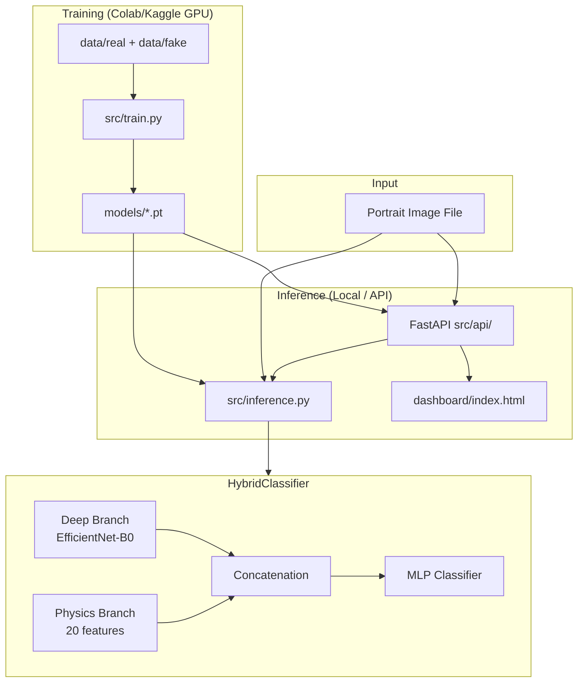

### Major components

| Component | Path | Role |
|-----------|------|------|
| Training entry | `src/train.py` | Stage 1 and hybrid training |
| Deep branch | `src/deep_branch/` | Preprocessing + EfficientNet |
| Physics branch | `src/physics_branch/` | Landmarks + forensic features |
| Fusion | `src/fusion/fuse.py` | Vector concatenation |
| Classifier head | `src/classifier/head.py` | `HybridClassifier`, `ClassificationHead` |
| Inference | `src/inference.py` | Single-image CLI inference |
| Explainability | `src/explain/gradcam.py` | Grad-CAM heatmaps |
| API | `src/api/` | REST endpoints |
| Database | `src/db/` | PostgreSQL prediction storage |
| Config | `src/config/` | YAML + Pydantic settings |
| Notebooks | `notebooks/` | Colab dataset prep + training |
| Docker | `docker/` | API + Postgres deployment |

### A. High-level system architecture

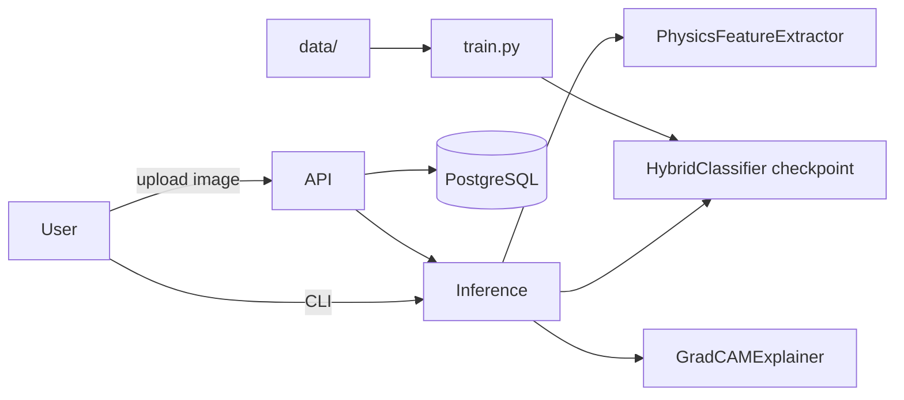

### B. Training architecture

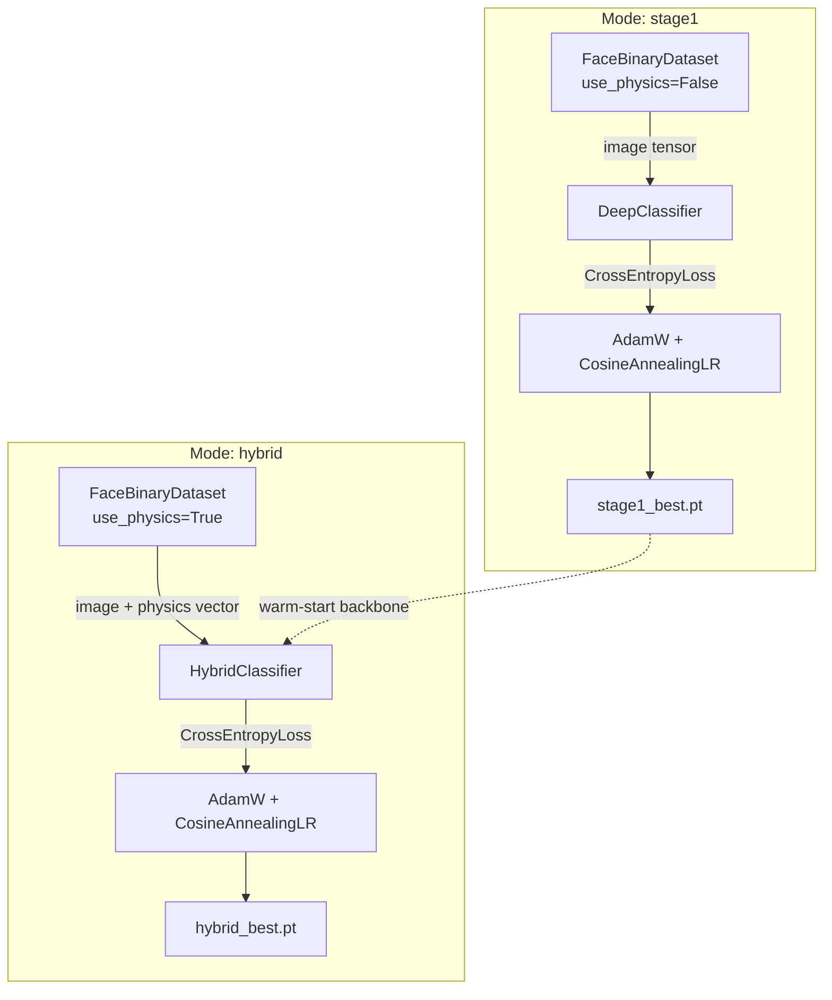

### C. Inference architecture

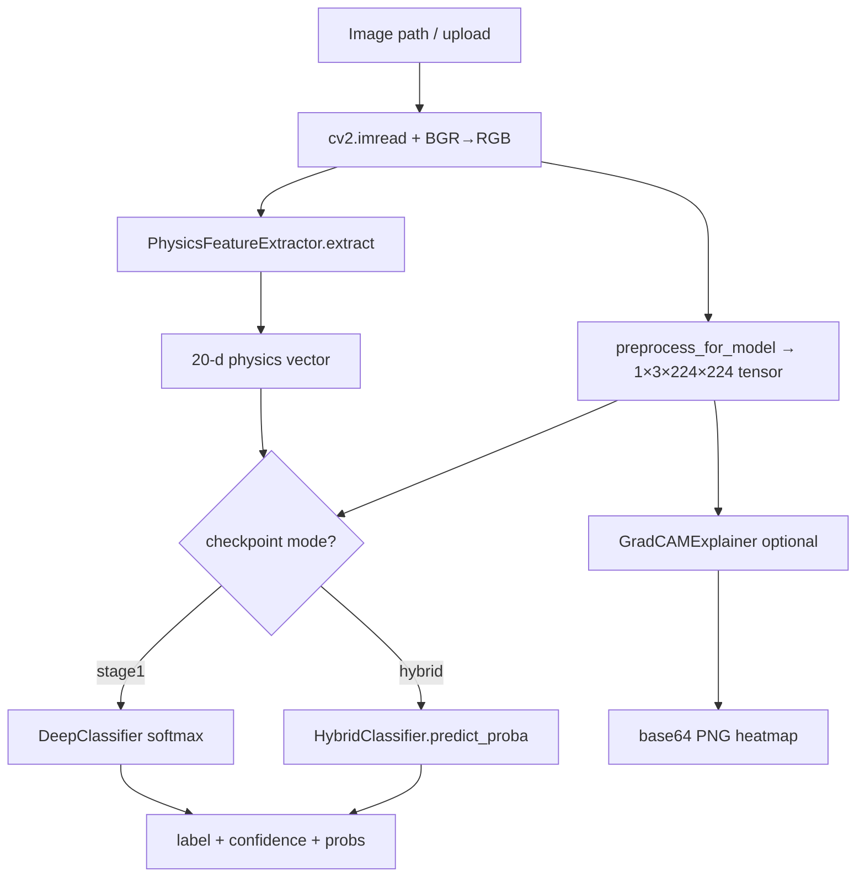

### D. Deep learning branch diagram

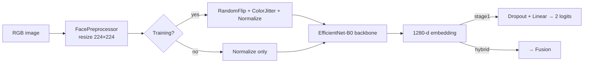

### E. Physics branch diagram

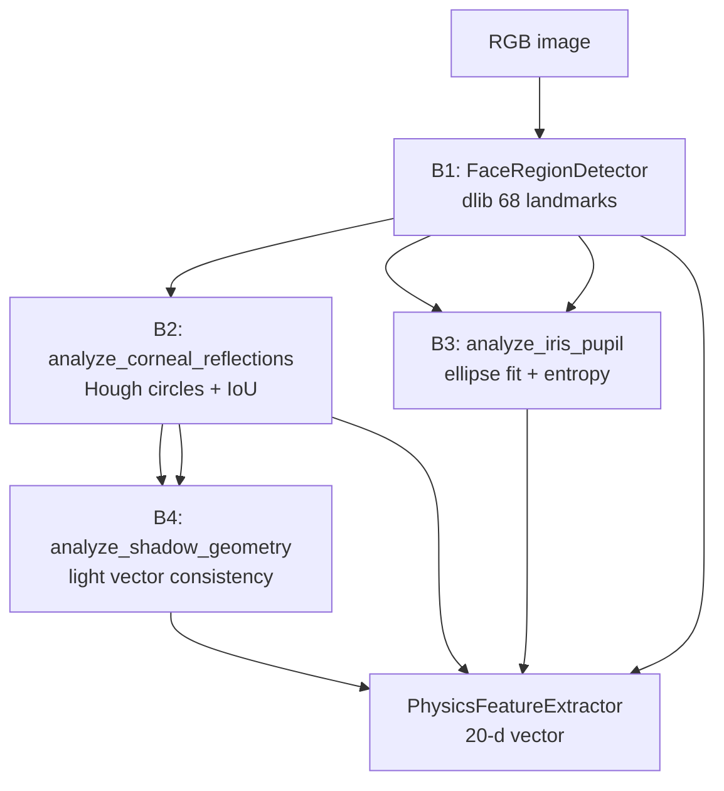

### F. Hybrid / fusion architecture

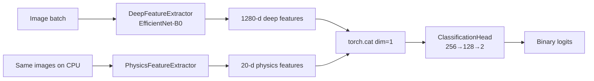

### G. Dataset preparation and train/validation flow

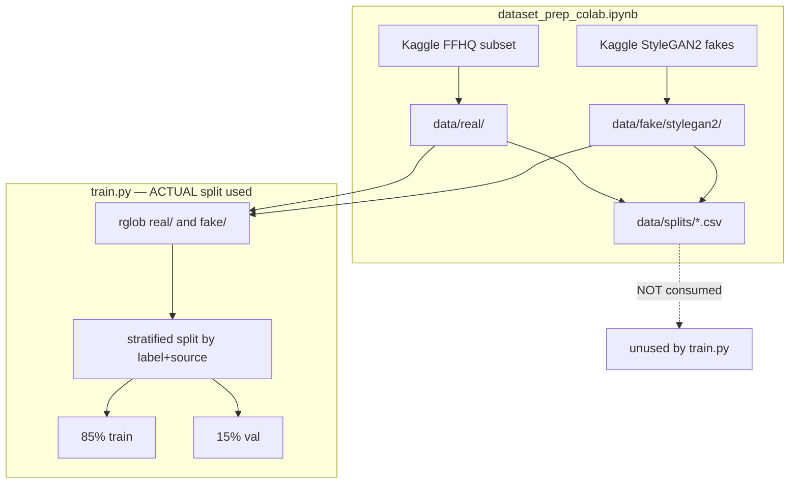

### H. API request/response flow

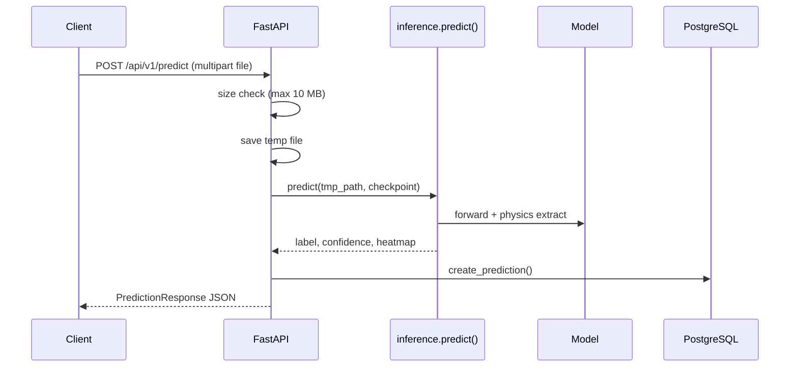

---

## 3. END-TO-END DATA FLOW

### Hybrid inference path (primary production path)

| Step | Input | Processing | Output | File / Function | Key parameters |
|------|-------|------------|--------|-----------------|----------------|
| 1. Load image | File path | `cv2.imread`, BGR→RGB | `H×W×3` RGB uint8 | `inference.predict()` | — |
| 2. Deep preprocess | RGB array | Resize 224, ToTensor, ImageNet normalize | `1×3×224×224` float tensor | `preprocess_for_model()` | `DEFAULT_IMAGE_SIZE=224` |
| 3. Physics extract | RGB array | dlib detect → B2/B3/B4 → aggregate | `20` float32 vector | `PhysicsFeatureExtractor.extract()` | See §6 |
| 4. Model load | Checkpoint path | `torch.load`, build `HybridClassifier` or `DeepClassifier` | Model on device | `load_model()` | Reads `mode` from checkpoint |
| 5. Forward | Image tensor + physics tensor | EfficientNet → concat → MLP | 2 logits | `HybridClassifier.forward()` | physics_dim=20 |
| 6. Probability | Logits | `softmax` | `[p_real, p_ai]` | `predict_proba()` | — |
| 7. Label | Probabilities | `argmax` | `"real"` or `"ai"` | `predict()` | 0=real, 1=ai |
| 8. Confidence | Probabilities | `max(probs) * 100` | 0–100 float | `predict()` | **No threshold applied** |
| 9. Grad-CAM (optional) | Image tensor | CAM on backbone last block; hybrid uses **zero physics** | base64 PNG | `GradCAMExplainer.generate_base64_png()` | target_class=predicted |

### Hybrid training path (per sample in `FaceBinaryDataset.__getitem__`)

| Step | Processing | File |
|------|------------|------|
| Load | `cv2.imread` → RGB | `train.py` |
| Physics | `PhysicsFeatureExtractor.extract(rgb)` if `use_physics=True`, else zeros | `train.py` |
| Deep preprocess | `FacePreprocessor.preprocess_pil` + transforms | `preprocessing.py` |
| Batch | DataLoader collates tensors | `train.py` |
| Forward | `model(images, physics)` | `HybridClassifier` |
| Loss | `CrossEntropyLoss` | `train.py` |

### What is NOT in the pipeline

- No dedicated **face crop** for the deep branch (full frame resized to 224×224).
- No **test-set evaluation** script.
- No **Fresnel equation** computation.
- No consumption of **CSV split files** during training.
- `config.yaml` **confidence_threshold** not applied at inference.

---

## 4. FILE-BY-FILE EXPLANATION

### Repository layout

```
tringtring/                          # Git workspace root
└── ai-vs-real-face-detector/        # Actual project root
    ├── src/
    ├── data/
    ├── models/
    ├── tests/
    ├── notebooks/
    ├── docker/
    ├── dashboard/
    ├── requirements.txt
    ├── requirements-local.txt
    └── README.md
```

---

### `src/` — Core application

#### `src/train.py`
| Attribute | Value |
|-----------|-------|
| **Purpose** | Main training script for Stage 1 and hybrid modes |
| **Classes** | `FaceBinaryDataset` |
| **Functions** | `set_seed`, `require_gpu`, `build_loaders`, `train_epoch_stage1`, `eval_stage1`, `train_epoch_hybrid`, `eval_hybrid`, `save_checkpoint`, `run_stage1`, `run_hybrid`, `parse_args`, `main` |
| **Called by** | Colab notebook shell commands |
| **Calls** | `DeepClassifier`, `HybridClassifier`, `FacePreprocessor`, `PhysicsFeatureExtractor`, PyTorch DataLoader |
| **Training** | Yes (both modes) |
| **Inference** | No |
| **Notes** | Creates own train/val split; tqdm only in hybrid training loop |

#### `src/inference.py`
| Attribute | Value |
|-----------|-------|
| **Purpose** | Single-image inference CLI + `predict()` API used by routes |
| **Functions** | `load_model`, `predict`, `main` |
| **Called by** | `src/api/routes.py`, CLI |
| **Calls** | `HybridClassifier`, `DeepClassifier`, `preprocess_for_model`, `PhysicsFeatureExtractor`, `GradCAMExplainer` |
| **Training** | No |
| **Inference** | Yes |

---

### `src/deep_branch/`

#### `preprocessing.py`
| Attribute | Value |
|-----------|-------|
| **Purpose** | Image resize, optional CV enhancements, torchvision transforms |
| **Classes** | `PreprocessConfig`, `FacePreprocessor` |
| **Functions** | `get_train_transforms`, `get_val_transforms`, `preprocess_for_model` |
| **Training** | Yes |
| **Inference** | Yes |
| **Bug note** | `_ensure_rgb_uint8` applies `BGR2RGB` on all 3-channel arrays — incorrect when input is already RGB (see §25) |

#### `feature_extractor.py`
| Attribute | Value |
|-----------|-------|
| **Classes** | `DeepFeatureExtractor`, `DeepClassifier` |
| **Purpose** | timm EfficientNet backbone + Stage 1 classifier head |
| **Training** | Stage 1 + hybrid (backbone part) |
| **Inference** | Yes |

#### `__init__.py`
Lazy exports for `DeepClassifier`, `DeepFeatureExtractor`.

---

### `src/physics_branch/`

#### `region_detection.py` — **CURRENT landmark implementation**
| Attribute | Value |
|-----------|-------|
| **Purpose** | dlib 68-point face/eye detection |
| **Classes** | `EyeRegion`, `FaceLandmarks`, `FaceRegionDetector` |
| **Functions** | `_ensure_model`, `draw_landmarks_debug` |
| **Training** | Yes (hybrid — per-sample physics) |
| **Inference** | Yes |
| **Legacy** | Replaced MediaPipe (comments only; no MediaPipe code remains) |

#### `corneal_reflection.py`
| Attribute | Value |
|-----------|-------|
| **Purpose** | Specular highlight detection + bilateral IoU |
| **Functions** | `detect_specular_highlight`, `analyze_corneal_reflections`, `compute_highlight_iou` |
| **Dead code** | `_normalize_highlight_mask` defined but **never called** |

#### `iris_pupil.py`
| Attribute | Value |
|-----------|-------|
| **Purpose** | Pupil boundary estimation, ellipse fit, iris entropy |
| **Functions** | `fit_pupil_ellipse`, `compute_iris_entropy`, `analyze_iris_pupil` |

#### `shadow_geometry.py`
| Attribute | Value |
|-----------|-------|
| **Purpose** | Light direction from highlight position; left/right consistency |
| **Functions** | `estimate_light_from_highlight`, `analyze_shadow_geometry` |

#### `feature_vector.py`
| Attribute | Value |
|-----------|-------|
| **Purpose** | Orchestrates B1–B4; defines 20-feature vector |
| **Classes** | `PhysicsFeatureVector`, `PhysicsFeatureExtractor` |

#### `__init__.py`
Lazy exports for physics extractor classes.

---

### `src/fusion/`

#### `fuse.py`
| Attribute | Value |
|-----------|-------|
| **Purpose** | Concatenate deep + physics tensors |
| **Classes** | `FeatureFusion` |
| **Functions** | `concatenate_features` |
| **Notes** | Comment mentions attention/gating as future work — **not implemented** |

---

### `src/classifier/`

#### `head.py`
| Attribute | Value |
|-----------|-------|
| **Classes** | `ClassificationHead`, `HybridClassifier` |
| **Purpose** | MLP on fused features; hybrid end-to-end model |
| **Training** | Hybrid mode |
| **Inference** | Yes (hybrid checkpoints) |

---

### `src/explain/`

#### `gradcam.py`
| Attribute | Value |
|-----------|-------|
| **Classes** | `GradCAMExplainer` |
| **Purpose** | Grad-CAM via `pytorch_grad_cam` on EfficientNet last block |
| **Quirk** | For `HybridClassifier`, passes **zero physics vector** during CAM |

---

### `src/api/`

#### `main.py`
FastAPI app factory: CORS, routes, static dashboard, DB session factory.

#### `routes.py`
Endpoints: `/health`, `/predict`, `/predictions`, `/predictions/{id}`.

#### `schemas.py`
Pydantic response models.

---

### `src/db/`

#### `models.py`
SQLAlchemy `PredictionRecord` table; `get_session_factory` creates tables on startup.

#### `crud.py`
`create_prediction`, `get_prediction`, `list_predictions`.

---

### `src/config/`

#### `config.yaml` + `__init__.py`
YAML loaded into Pydantic `AppConfig`. **Physics and inference thresholds in config are mostly unused by runtime logic** (see §23).

---

### `src/monitoring/logger.py`
Logging setup; `log_inference_timing`, `log_prediction` helpers (prediction logging not wired from API routes).

---

### `src/scripts/debug_physics.py`
Local physics visualization CLI. **Experimental/debug.**

---

### `tests/`

| File | Verifies |
|------|----------|
| `test_preprocessing.py` | Output shapes 224×224 and tensor 1×3×224×224 |
| `test_fusion.py` | Concatenation dimensions (1280+20=1300) |
| `test_physics_branch.py` | IoU, highlight detection, ellipse fit, feature dim, shadow geometry |
| `conftest.py` | Adds project root to `sys.path` |

**No API tests. No end-to-end model tests. No training integration tests.**

---

### `notebooks/`

| Notebook | Purpose |
|----------|---------|
| `dataset_prep_colab.ipynb` | Download FFHQ + StyleGAN2 from Kaggle; create CSV splits |
| `train_colab.ipynb` | GPU check, pip install, run `train.py` stage1 + hybrid |

**Also present:** `kaggle.json` — **contains API credentials** (security risk; see §26).

---

### `data/`

| Path | Status |
|------|--------|
| `data/real/.gitkeep` | Placeholder only — **no images in repo** |
| `data/fake/.gitkeep` | Placeholder only — **no images in repo** |
| `data/splits/*.csv` | **Not in repo** — created by notebook, **not used by train.py** |

---

### `models/`

| Path | Status |
|------|--------|
| `models/.gitkeep` | **No checkpoints in repo** |

---

### `docker/`

| File | Purpose |
|------|---------|
| `Dockerfile` | Python 3.11 slim, installs requirements, runs uvicorn |
| `docker-compose.yml` | `app` + `postgres:15` services |

---

### `dashboard/index.html`
Static upload UI calling `POST /api/v1/predict`.

---

### Root misc files

| File | Purpose |
|------|---------|
| `README.md` | Quick start (partially outdated re: MediaPipe) |
| `requirements.txt` | Includes `requirements-local.txt` |
| `requirements-local.txt` | Core dependencies |
| `1.4.0` | **Accidental pip install log** — not part of project design |

---

## 5. DEEP LEARNING BRANCH

### Model architecture

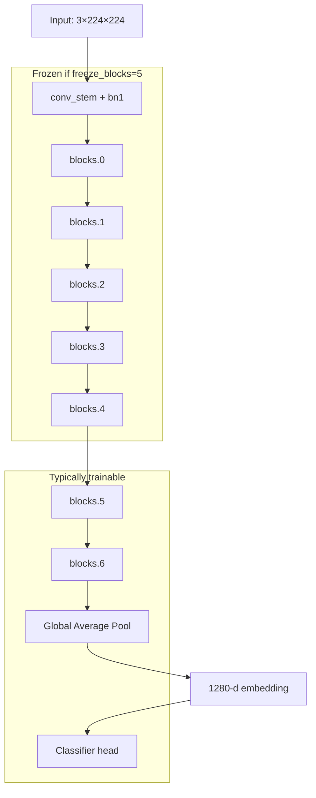

### Details (from code)

| Parameter | Value | Source |
|-----------|-------|--------|
| Backbone | `efficientnet_b0` (timm) | `DeepFeatureExtractor.__init__` |
| Input size | 224×224 | `DEFAULT_IMAGE_SIZE` |
| Pretrained | `True` during training; `False` when loading checkpoint for inference | `train.py`, `inference.py` |
| Global pool | `"avg"` | `timm.create_model(..., global_pool="avg")` |
| Embedding dim | 1280 (`backbone.num_features`) | timm EfficientNet-B0 |
| Frozen layers | `conv_stem`, `bn1`, `blocks.0` … `blocks.(freeze_blocks-1)` | `freeze_blocks=5` default |
| Stage 1 head | `Dropout(0.3) → Linear(1280, 2)` | `DeepClassifier` |
| Activation | ReLU in hybrid MLP only; backbone uses EfficientNet activations | `ClassificationHead` |
| Loss | `nn.CrossEntropyLoss()` | `train.py` |
| Optimizer | `AdamW`, `lr=1e-4`, `weight_decay=1e-4` | `parse_args` defaults |
| Scheduler | `CosineAnnealingLR(T_max=epochs)` | `train.py` |
| Batch size | 32 (default) | CLI |
| Epochs | 10 stage1, 15 hybrid (notebook examples) | CLI |
| Augmentation (train) | `RandomHorizontalFlip(0.5)`, `ColorJitter(brightness=0.1, contrast=0.1, saturation=0.05)` | `get_train_transforms` |
| Normalization | ImageNet mean/std | `IMAGENET_MEAN`, `IMAGENET_STD` |
| Checkpointing | Best **validation accuracy** → `stage1_best.pt` / `hybrid_best.pt` | `save_checkpoint` |
| Best-model metric | Validation accuracy only (not F1, not loss) | `run_stage1`, `run_hybrid` |

### Why EfficientNet-B0?

The code does not document a formal ablation. README/implied rationale: good accuracy vs compute tradeoff for Colab GPU training. **ResNet and other backbones are not implemented** — only configurable via `--backbone` timm name string without project-specific validation.

### Optional preprocessing (disabled by default)

`PreprocessConfig`: bilateral filter, CLAHE, LAB conversion — all **off** during training for speed.

---

## 6. PHYSICS / COMPUTER VISION BRANCH

### Pipeline overview

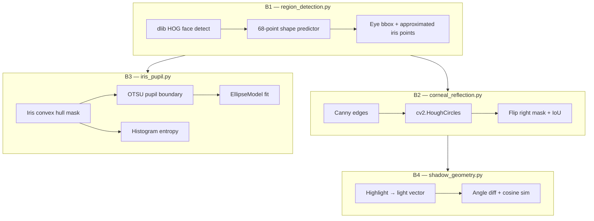

### Feature-by-feature (only what is implemented)

#### 1. Face detection flag (`face_detected`)
- **Measures:** Whether dlib found a face with 68 landmarks.
- **Why useful:** Physics features are meaningless without a face.
- **Calculation:** `float(landmarks.detected)` — 1.0 or 0.0.
- **File:** `feature_vector.py` ← `region_detection.py`

#### 2. Highlight IoU (`highlight_iou`)
- **Measures:** Overlap of left and horizontally-flipped right corneal highlight masks (64×64).
- **Why useful:** Real faces often show symmetric specular highlights; GAN faces may show inconsistent reflections (per cited Hu et al. 2021 inspiration in README).
- **Calculation:** `detect_specular_highlight` per eye → resize masks → flip right → `intersection/union`.
- **File:** `corneal_reflection.py` — `analyze_corneal_reflections`
- **Range:** [0, 1]

#### 3. Highlight consistency (`highlight_consistent`)
- **Measures:** Boolean: `highlight_iou >= 0.35`.
- **File:** `corneal_reflection.py` (threshold hardcoded; matches `config.yaml` but not read from config)

#### 4–5. Highlight offset (`highlight_offset_x`, `highlight_offset_y`)
- **Measures:** Difference between left and right highlight centers in eye-crop coordinates.
- **File:** `_highlight_offset` in `corneal_reflection.py`

#### 6–8. Pupil eccentricity (`left_pupil_eccentricity`, `right_pupil_eccentricity`, `pupil_eccentricity_diff`)
- **Measures:** Ellipse eccentricity of estimated pupil boundary; absolute difference between eyes.
- **Calculation:** OTSU inverse threshold inside approximated iris mask → largest contour → `skimage.measure.EllipseModel` → `ecc = sqrt(1 - (b/a)²)`.
- **File:** `iris_pupil.py`
- **Range:** [0, 1] for eccentricity; diff ≥ 0

#### 9. Pupil regularity mean (`pupil_regularity_mean`)
- **Measures:** Mean of `(1 - eccentricity)` for detected pupils.
- **File:** `iris_pupil.py`

#### 10–13. Iris entropy (`left_iris_entropy`, `right_iris_entropy`, `iris_entropy_mean`, `iris_entropy_diff`)
- **Measures:** Shannon entropy of grayscale intensities inside approximated iris region.
- **Why useful:** Synthetic irises may lack natural texture complexity.
- **File:** `compute_iris_entropy` in `iris_pupil.py`
- **Range:** ≥ 0 (typically single-digit to ~8 for 8-bit)

#### 14–16. Lighting consistency (`light_angle_diff_deg`, `light_cosine_similarity`, `light_consistent`)
- **Measures:** Whether inferred light directions from highlights are consistent across eyes after horizontal mirroring of the right vector.
- **Calculation:** Unit vector from eye center to highlight; compare angle difference and cosine similarity.
- **Thresholds:** angle ≤ 25°, cosine ≥ 0.85 (hardcoded in `analyze_shadow_geometry`)
- **File:** `shadow_geometry.py`
- **Note:** Despite module name "shadow_geometry", **no actual shadow map or face shadow analysis is implemented** — only highlight-based light direction.

#### 17–20. Detection flags
- `left_highlight_detected`, `right_highlight_detected`, `left_pupil_detected`, `right_pupil_detected`
- Binary indicators for sub-detector success.

### When face/eyes missing

All modules return safe defaults (zeros, `consistent=False`, `angle_difference_deg=180`, etc.) — pipeline **does not raise**; model receives a mostly-zero physics vector.

---

## 7. FACE / LANDMARK DETECTION

### CURRENT implementation: **dlib**

| Aspect | Implementation |
|--------|----------------|
| Face detector | `dlib.get_frontal_face_detector()` (HOG) |
| Landmark model | `shape_predictor_68_face_landmarks.dat` (~95 MB, auto-downloaded to `~/.cache/dlib_models/`) |
| Landmark count | **68** |
| Right eye indices | `[36, 37, 38, 39, 40, 41]` (anatomical right = left side of image) |
| Left eye indices | `[42, 43, 44, 45, 46, 47]` |
| Iris landmarks | **Approximated** — 5 points from eye contour centroid + radius (`iris_radius_ratio=0.22`) |
| Eye crop padding | `eye_padding_ratio=0.35` |
| Large image handling | Downscale to max dim 512 for detection, scale rect back |
| Face selection | Largest face bounding box |

### LEGACY / UNUSED: **MediaPipe**

- README and `train_colab.ipynb` still reference MediaPipe.
- `requirements-local.txt` lists `mediapipe>=0.10.0`.
- `tests/test_physics_branch.py` has `pytest.importorskip("mediapipe")` but **does not use MediaPipe**.
- **No MediaPipe import exists in `src/` physics code.** Replaced due to TFLite/XNNPACK threading deadlock during hybrid training (documented in `region_detection.py` header).

### OpenCV usage

Used throughout for I/O, resizing, Canny, Hough circles, contours, masks — not for face landmarks.

### Limitations

- dlib 68-point model lacks true iris landmarks → iris/pupil analysis is **heuristic**.
- Single face only (`max_num_faces=1` parameter exists but only largest face kept).
- `debug_physics.py` passes **BGR** image to detector without conversion — may cause incorrect colors in eye crops (see §25).

---

## 8. CORNEAL REFLECTION / FRESNEL PHYSICS

### Status: **Fresnel reflection is not directly implemented in the current codebase.**

| Aspect | Status |
|--------|--------|
| Fresnel equations (n₁, n₂, θᵢ, R_s, R_p) | **Not present** |
| Physical reflectance modeling | **Not present** |
| Conceptual reference | Module docstring says "Fresnel reflection consistency" |
| Actual implementation | **Computer vision heuristic:** Gaussian blur → Canny → `cv2.HoughCircles` on eye crop; fallback to brightest pixel |

### What IS implemented

- **Specular highlight detection** via Hough circles / brightness fallback
- **Geometric consistency checks:** IoU between left/right highlight masks; offset vectors
- **Light direction estimation** from highlight position relative to eye center (not from Fresnel physics)

### Partial / conceptual only

The project **conceptually** targets corneal specular highlight inconsistency (GAN detection literature) but implements **image processing proxies**, not optical physics simulation.

### Dead code note

`_normalize_highlight_mask()` in `corneal_reflection.py` appears intended for full-image mask alignment but is **unused**; `_align_eye_highlight_to_canonical()` resizes eye-local masks only.

---

## 9. FEATURE VECTOR

### Complete table (20 features — `PHYSICS_FEATURE_NAMES`)

| # | Feature | Meaning | Source file | Typical range | Used in Hybrid? |
|---|---------|---------|-------------|---------------|-----------------|
| 0 | `face_detected` | dlib found face | `feature_vector.py` | 0 or 1 | Yes |
| 1 | `highlight_iou` | Bilateral highlight mask IoU | `corneal_reflection.py` | [0, 1] | Yes |
| 2 | `highlight_consistent` | IoU ≥ 0.35 | `corneal_reflection.py` | 0 or 1 | Yes |
| 3 | `highlight_offset_x` | L-R highlight x offset | `corneal_reflection.py` | pixels (crop space) | Yes |
| 4 | `highlight_offset_y` | L-R highlight y offset | `corneal_reflection.py` | pixels (crop space) | Yes |
| 5 | `left_pupil_eccentricity` | Left pupil ellipse eccentricity | `iris_pupil.py` | [0, 1] | Yes |
| 6 | `right_pupil_eccentricity` | Right pupil ellipse eccentricity | `iris_pupil.py` | [0, 1] | Yes |
| 7 | `pupil_eccentricity_diff` | abs(L-R eccentricity) | `iris_pupil.py` | [0, 1] | Yes |
| 8 | `pupil_regularity_mean` | Mean(1 - eccentricity) | `iris_pupil.py` | [0, 1] | Yes |
| 9 | `left_iris_entropy` | Left iris Shannon entropy | `iris_pupil.py` | ≥ 0 | Yes |
| 10 | `right_iris_entropy` | Right iris Shannon entropy | `iris_pupil.py` | ≥ 0 | Yes |
| 11 | `iris_entropy_mean` | Mean L/R entropy | `feature_vector.py` | ≥ 0 | Yes |
| 12 | `iris_entropy_diff` | abs(L-R entropy) | `feature_vector.py` | ≥ 0 | Yes |
| 13 | `light_angle_diff_deg` | Light vector angle difference | `shadow_geometry.py` | [0, 180] | Yes |
| 14 | `light_cosine_similarity` | Cosine sim of light vectors | `shadow_geometry.py` | [-1, 1] | Yes |
| 15 | `light_consistent` | Angle+cosine thresholds met | `shadow_geometry.py` | 0 or 1 | Yes |
| 16 | `left_highlight_detected` | Left highlight found | `corneal_reflection.py` | 0 or 1 | Yes |
| 17 | `right_highlight_detected` | Right highlight found | `corneal_reflection.py` | 0 or 1 | Yes |
| 18 | `left_pupil_detected` | Left pupil ellipse fit ok | `iris_pupil.py` | 0 or 1 | Yes |
| 19 | `right_pupil_detected` | Right pupil ellipse fit ok | `iris_pupil.py` | 0 or 1 | Yes |

### Normalization

**No normalization** is applied to the physics vector before model input — raw floats are passed to `HybridClassifier`.

### Missing values

Not represented as NaN — failed sub-detections use **0.0** or sentinel defaults (e.g., angle diff = 180).

### Ordering

Fixed in `PHYSICS_FEATURE_NAMES` — order must not change without retraining.

---

## 10. HYBRID / FUSION MODEL

| Property | Value |
|----------|-------|
| Deep feature dim | 1280 |
| Physics feature dim | 20 |
| Fusion method | **Concatenation** (`torch.cat` dim=1) |
| Fused dim | 1300 |
| Fusion class | `FeatureFusion` in `fuse.py` |
| Classifier | `ClassificationHead`: Linear(1300→256)→BN→ReLU→Dropout(0.3)→Linear(256→128)→BN→ReLU→Dropout(0.3)→Linear(128→2) |
| Loss | CrossEntropyLoss |
| Optimizer | AdamW (all `requires_grad` params) |
| Learning rate | 1e-4 default |
| Stage 1 warm-start | Loads `feature_extractor.*` weights from `stage1_best.pt` if present |
| Classifier from Stage 1 | **Not loaded** — hybrid MLP trains from scratch |
| Frozen backbone | Same `freeze_blocks` logic as Stage 1 |
| Physics during training | Computed on CPU per sample in `Dataset.__getitem__` — **not differentiable**, not part of autograd |
| Stage 1 vs hybrid difference | Stage 1: image only. Hybrid: image + physics vector + deeper MLP head |

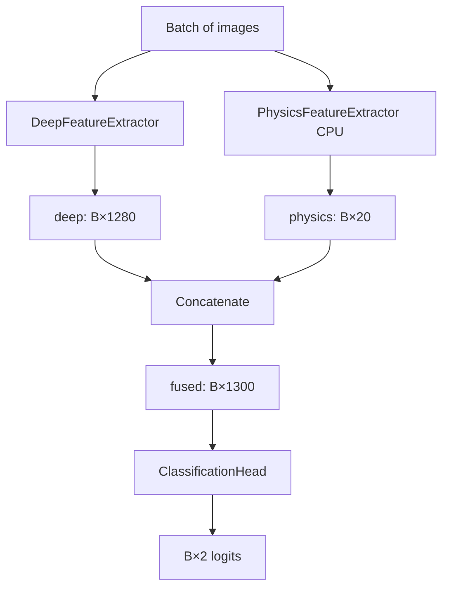

---

## 11. TRAINING PIPELINE

### Stage 1 workflow

1. Parse CLI args (`--mode stage1`)
2. Require CUDA GPU (unless `--allow-cpu`)
3. `set_seed(42)`
4. `build_loaders` → stratified train/val split (`val_ratio=0.15`)
5. Initialize `DeepClassifier(pretrained=True, freeze_blocks=5)`
6. `CrossEntropyLoss` + `AdamW` + `CosineAnnealingLR`
7. For each epoch: `train_epoch_stage1` → `eval_stage1`
8. Save `stage1_best.pt` when val accuracy improves
9. Write `stage1_history.json`

### Hybrid workflow

1. `--mode hybrid`
2. Same data loaders but `use_physics=True` (physics extracted per image)
3. Initialize `HybridClassifier`
4. If `models/stage1_best.pt` exists → load backbone weights only
5. Train with `train_epoch_hybrid` (tqdm progress bar) → `eval_hybrid`
6. Save `hybrid_best.pt` + `hybrid_history.json`

### All CLI arguments (`train.py`)

| Argument | Default | Description |
|----------|---------|-------------|
| `--mode` | `stage1` | `stage1` or `hybrid` |
| `--data-dir` | `data` | Root with `real/` and `fake/` |
| `--output-dir` | `models` | Checkpoint output directory |
| `--backbone` | `efficientnet_b0` | timm model name |
| `--freeze-blocks` | `5` | Early EfficientNet blocks to freeze |
| `--epochs` | `10` | Training epochs |
| `--batch-size` | `32` | Batch size |
| `--lr` | `1e-4` | Learning rate |
| `--weight-decay` | `1e-4` | AdamW weight decay |
| `--val-ratio` | `0.15` | Validation fraction per (label, source) group |
| `--num-workers` | `2` | DataLoader workers |
| `--seed` | `42` | Random seed |
| `--allow-cpu` | flag | CPU smoke test only |

### Example commands (from actual code/README)

```bash
# Stage 1 — deep branch baseline
python src/train.py --mode stage1 --data-dir data --epochs 10 --batch-size 32 --output-dir models

# Hybrid — deep + physics (run after stage1)
python src/train.py --mode hybrid --data-dir data --epochs 15 --batch-size 32 --output-dir models

# CPU smoke test (not for real training)
python src/train.py --mode stage1 --allow-cpu --epochs 1 --batch-size 2
```

---

## 12. DATASET

### Expected directory structure

```
data/
├── real/                    # label 0
│   └── *.jpg|png|jpeg|webp
└── fake/                    # label 1
    ├── stylegan2/           # source tag: stylegan2
    │   └── *.jpg|...
    └── diffusion/           # source tag: diffusion (planned)
        └── *.jpg|...
```

### In repository

- **No actual images** — only `.gitkeep` placeholders.
- **Image count:** Not determinable from the current repository.

### Intended datasets (from notebooks)

| Class | Source | Notebook default count |
|-------|--------|------------------------|
| Real | Kaggle `pankymathur/ffhq-224k` | 5000 (`N_REAL`) |
| Fake (StyleGAN2) | Kaggle `hyperclaw79/fakefaces` | 5000 (`N_FAKE`) |
| Fake (diffusion) | Purdue AI-Face-FairnessBench (Phase 2) | **Not implemented in notebook** — folder created only |

### Balancing

Notebook copies equal `N_REAL` and `N_FAKE`. `train.py` does **not** enforce class balance — uses whatever files exist.

### Splitting

| Method | Train | Val | Test | Used by training? |
|--------|-------|-----|------|-------------------|
| `dataset_prep_colab.ipynb` CSV | 70% | 15% | 15% | **No** |
| `train.py` internal | 85% | 15% | 0% | **Yes** |

`train.py` stratifies by `(label, source)` e.g. `(0, real)`, `(1, stylegan2)`, `(1, diffusion)`.

### Data leakage risks

- Same person's images across splits: **not addressed** (FFHQ may contain related faces).
- Notebook CSV split and `train.py` split use **different ratios and seeds** — if both exist, they disagree.
- No explicit test evaluation → test CSV from notebook is unused.

### Image formats

`.jpg`, `.jpeg`, `.png`, `.webp` (case-insensitive extension check).

---

## 13. DATA PREPARATION NOTEBOOKS

### `notebooks/dataset_prep_colab.ipynb`

| Aspect | Detail |
|--------|--------|
| **Purpose** | Download and organize FFHQ real + StyleGAN2 fake faces; create CSV splits |
| **GPU required** | No |
| **Mounts Google Drive** | Yes — `PROJECT_DIR = '/content/drive/MyDrive/ai-vs-real-face-detector'` |
| **Clones GitHub** | No (expects manual project setup) |
| **Installs** | `kaggle` pip package |
| **Inputs** | Kaggle API token (`kaggle.json` upload) |
| **Outputs** | `data/real/`, `data/fake/stylegan2/`, `data/splits/train.csv`, `val.csv`, `test.csv` |
| **Modifies Drive** | Yes — writes to `MyDrive/ai-vs-real-face-detector/data/` |
| **Phase 2** | Commented-out cells for diffusion + improved stratified split |

### `notebooks/train_colab.ipynb`

| Aspect | Detail |
|--------|--------|
| **Purpose** | GPU training orchestration |
| **GPU required** | Yes (asserts CUDA) |
| **Mounts Drive** | Example cell (commented symlink) |
| **Installs** | `torch`, `torchvision`, `timm`, `opencv-python`, `mediapipe`, `scikit-image`, `pytorch-grad-cam`, `pyyaml`, `pillow` |
| **Missing from pip cell** | **dlib** (required by current physics code), `tqdm`, FastAPI deps |
| **Commands run** | `python src/train.py --mode stage1 ...` and `--mode hybrid ...` |
| **Output** | `models/hybrid_best.pt` download via `files.download` |

---

## 14. MODEL CHECKPOINTS

### Referenced checkpoint files

| File | Generated when | Contents | Used for inference? |
|------|----------------|----------|---------------------|
| `models/stage1_best.pt` | Stage 1 best val accuracy | `model_state_dict`, `optimizer_state_dict`, `epoch`, `metrics`, `mode="stage1"`, `args`, `physics_dim` | Yes (if passed to `inference.py`) |
| `models/hybrid_best.pt` | Hybrid best val accuracy | Same structure, `mode="hybrid"` | **Yes — primary** (API default) |
| `models/stage1_history.json` | End of Stage 1 | Per-epoch train/val metrics | No |
| `models/hybrid_history.json` | End of hybrid | Per-epoch train/val metrics | No |

### In repository

**No checkpoint files present** — only `models/.gitkeep`.

### Loading

```python
ckpt = torch.load(path, map_location=device)
mode = ckpt.get("mode", "hybrid")
model.load_state_dict(ckpt["model_state_dict"], strict=False)
```

Hybrid training warm-start extracts keys prefixed `feature_extractor.` from Stage 1 state dict.

### Format

PyTorch `.pt` (pickle-based `torch.save` dict).

---

## 15. INFERENCE PIPELINE

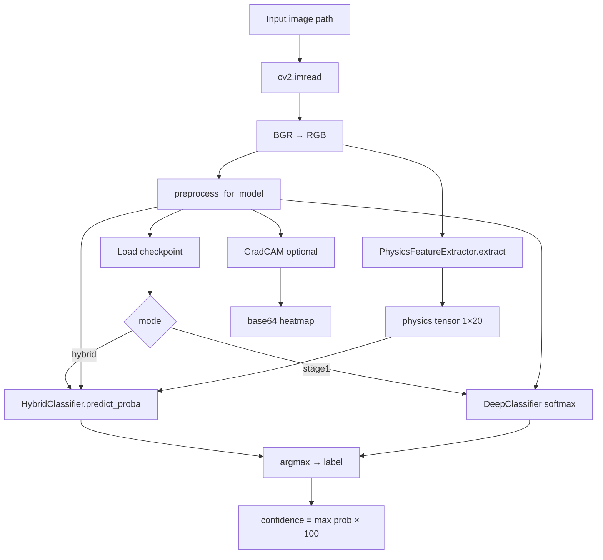

| Aspect | Behavior |
|--------|----------|
| Default checkpoint | `models/hybrid_best.pt` |
| Threshold | **None applied** — pure argmax (config `confidence_threshold` unused) |
| Class labels | `0 → "real"`, `1 → "ai"` |
| Output format | JSON dict |
| Error: bad image | `FileNotFoundError` |
| Error: Grad-CAM fail | Caught; `heatmap_error` in result |

### CLI

```bash
python src/inference.py path/to/face.jpg --checkpoint models/hybrid_best.pt
python src/inference.py path/to/face.jpg --no-heatmap --output-json result.json
```

---

## 16. API / BACKEND

### Framework

**FastAPI** + **Uvicorn** (Docker CMD).

### Endpoints

| Method | Path | Description |
|--------|------|-------------|
| GET | `/` | HTML landing page |
| GET | `/docs` | OpenAPI Swagger UI |
| GET | `/dashboard/` | Static upload dashboard |
| GET | `/api/v1/health` | Health + `model_loaded` flag |
| POST | `/api/v1/predict` | Upload image → prediction + DB record |
| GET | `/api/v1/predictions` | List recent predictions (`limit=50`) |
| GET | `/api/v1/predictions/{id}` | Get single prediction |

### POST `/api/v1/predict`

**Request:** `multipart/form-data` with `file` field.

**Response (`PredictionResponse`):**
```json
{
  "label": "ai",
  "confidence_score": 87.5,
  "probability_distribution": { "real": 12.5, "ai": 87.5 },
  "heatmap": "<base64 PNG or null>",
  "heatmap_error": null,
  "prediction_id": 1,
  "model_version": "0.1.0"
}
```

### Validation

- Max upload size: `max_upload_size_mb` from config (10 MB) → HTTP 413
- Model missing → HTTP 503
- Other errors → HTTP 500 with exception string

### Model loading

Checkpoint path from `config.yaml` → `model.checkpoint_path`. Existence checked at startup (`model_loaded` flag) — **model weights loaded per-request** inside `predict()` (not cached singleton).

### CORS

`allow_origins: ["*"]` from config.

### Startup

```bash
cd docker
docker compose up --build
# API: http://localhost:8000/docs
```

---

## 17. DATABASE

### Technology

**PostgreSQL 15** (Docker) + **SQLAlchemy 2.0** ORM.

### Table: `predictions`

| Column | Type | Purpose |
|--------|------|---------|
| `id` | Integer PK | Auto-increment |
| `created_at` | DateTime | UTC timestamp |
| `filename` | String(512) | Uploaded filename |
| `label` | String(16) | `real` or `ai` |
| `confidence_score` | Float | Percentage |
| `prob_real` | Float | Real class % |
| `prob_ai` | Float | AI class % |
| `model_version` | String(32) | From config |
| `heatmap_base64` | Text | Optional CAM image |
| `error_message` | Text | Optional |

### ER diagram

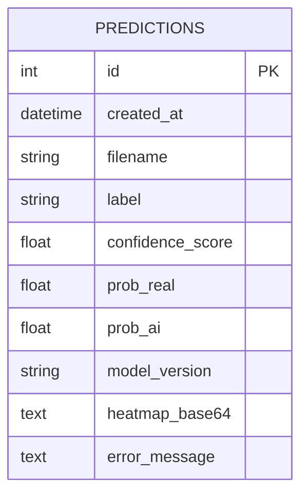

### Config mismatch

`docker-compose.yml` sets `DATABASE_URL` env var, but `src/config/config.yaml` hardcodes `postgresql://postgres:postgres@db:5432/face_detector`. The app reads **config.yaml**, not `DATABASE_URL` — env override is **not wired**.

---

## 18. DEPENDENCIES

### `requirements-local.txt` (actual packages)

| Package | Version constraint | Purpose | Where used |
|---------|-------------------|---------|------------|
| numpy | >=1.24, <2.0 | Arrays | Throughout |
| Pillow | >=10.0 | Image I/O | preprocessing, Grad-CAM |
| PyYAML | >=6.0 | Config | `src/config/` |
| opencv-python | >=4.8 | CV ops | preprocessing, physics |
| scikit-image | >=0.21 | EllipseModel | `iris_pupil.py` |
| mediapipe | >=0.10 | **Listed but unused in src/** | Legacy/tests skip only |
| pytest | >=7.4 | Testing | `tests/` |
| pytest-cov | >=4.1 | Coverage | tests |
| fastapi | >=0.100 | API | `src/api/` |
| uvicorn | >=0.23 | ASGI server | Docker |
| python-multipart | >=0.0.6 | File uploads | API |
| sqlalchemy | >=2.0 | ORM | `src/db/` |
| psycopg2-binary | >=2.9 | PostgreSQL driver | Docker DB |
| pydantic | >=2.0 | Schemas | API, config |
| pydantic-settings | >=2.0 | Settings | config |
| torch | >=2.0 | Deep learning | train, inference |
| torchvision | >=0.15 | Transforms | preprocessing |
| timm | >=0.9 | EfficientNet | feature_extractor |
| grad-cam | >=1.4.0 | Explainability | gradcam.py |

### Missing from requirements (but required by code)

| Package | Required by |
|---------|-------------|
| **dlib** | `region_detection.py` — **critical for physics** |
| **tqdm** | `train.py` hybrid loop |

### Notebook-only dependencies

`kaggle`, `pandas`, `sklearn`, `matplotlib` — used in Colab notebooks only.

### Suspicious / conflicts

- **mediapipe** in requirements but code uses **dlib** — inconsistent.
- **numpy <2.0** constraint may conflict with newer torch builds.
- `1.4.0` file at project root is accidental pip log.
- `notebooks/kaggle.json` contains live API credentials — should not be committed.

---

## 19. TESTING

### Run tests

```bash
cd ai-vs-real-face-detector
pip install -r requirements.txt
pip install dlib   # required for full physics tests if detector instantiated
pytest tests/ -v
```

### Test coverage summary

| File | Type | What it verifies |
|------|------|------------------|
| `test_preprocessing.py` | Unit | 224×224 output, tensor shape |
| `test_fusion.py` | Unit | Concatenation math, output_dim |
| `test_physics_branch.py` | Unit | IoU, synthetic highlight, ellipse on circle, feature dimension, shadow defaults, light vector |

### Not tested

- API endpoints
- Full inference pipeline with real checkpoint
- Training loops
- dlib face detection integration
- Grad-CAM output
- Database CRUD

---

## 20. DEBUGGING TOOLS

### `src/scripts/debug_physics.py`

| Aspect | Detail |
|--------|--------|
| **Purpose** | Visualize physics pipeline on one image |
| **Input** | Image path |
| **Output dir** | `debug_out/` default |
| **Generated files** | `landmarks.jpg`, `left_eye.jpg`, `right_eye.jpg`, `left_edges.jpg`, `right_edges.jpg`, `left_highlight.jpg`, `right_highlight.jpg`, `report.json` |
| **GPU** | Not required |
| **Run** | `python src/scripts/debug_physics.py path/to/portrait.jpg --output-dir debug_out/` |

### `draw_landmarks_debug()` in `region_detection.py`

Used by debug script to overlay eye bboxes, contour points, approximated iris points.

---

## 21. GITHUB / DEVELOPMENT WORKFLOW

### Repository structure

Git root: `C:\tringtring` with project in `ai-vs-real-face-detector/`.

### Branches (detected)

- `master` (current)
- `main`
- `remotes/origin/main`, `remotes/origin/master`

### Recent commit themes

dlib migration, OpenCV Hough circles, training threading fixes, Colab notebook updates.

### Local setup

```bash
cd ai-vs-real-face-detector
python -m venv .venv
.venv\Scripts\activate        # Windows
pip install -r requirements.txt
pip install dlib tqdm           # not in requirements — needed
pytest tests/ -v
```

### Training

Colab/Kaggle GPU only (by design). See §22.

### Inference locally

Download `hybrid_best.pt` from Colab → place in `models/` → run `inference.py` or Docker API.

---

## 22. GOOGLE COLAB WORKFLOW

Derived from actual notebooks (adjust paths as needed):

### A. Dataset preparation (`dataset_prep_colab.ipynb`)

1. Open notebook in Colab (GPU **not** required).
2. Mount Google Drive.
3. Set `PROJECT_DIR` and create `data/real`, `data/fake/stylegan2`, `data/fake/diffusion`.
4. Upload `kaggle.json` → install kaggle CLI.
5. Download FFHQ: `kaggle datasets download -d pankymathur/ffhq-224k` → copy 5000 images to `data/real/`.
6. Download fakes: `kaggle datasets download -d hyperclaw79/fakefaces` → copy 5000 to `data/fake/stylegan2/`.
7. Preview samples with matplotlib.
8. Create CSV splits in `data/splits/` (optional — **training ignores these**).
9. Proceed to training notebook.

### B. Training (`train_colab.ipynb`)

1. **Enable GPU:** Runtime → Change runtime type → T4 GPU.
2. Clone/upload project to Colab.
3. Install dependencies:
   ```python
   !pip install -q torch torchvision timm opencv-python scikit-image pytorch-grad-cam pyyaml pillow dlib tqdm
   ```
   (**Add dlib and tqdm** — not in notebook cell but required by current code.)
4. Optional: mount Drive and symlink dataset.
5. **Stage 1:**
   ```bash
   !python src/train.py --mode stage1 --data-dir data --epochs 10 --batch-size 32 --output-dir models
   ```
6. Verify `models/stage1_best.pt` exists.
7. **Hybrid:**
   ```bash
   !python src/train.py --mode hybrid --data-dir data --epochs 15 --batch-size 32 --output-dir models
   ```
8. Download checkpoint:
   ```python
   from google.colab import files
   files.download('models/hybrid_best.pt')
   ```
9. Evaluate locally with `inference.py` (no automated eval script in repo).

---

## 23. CONFIGURATION PARAMETERS

| Parameter | Default | Location | What changing it does |
|-----------|---------|----------|----------------------|
| `image_size` | 224 | `preprocessing.py` | Input spatial size for EfficientNet |
| `batch_size` | 32 | CLI `--batch-size` | GPU memory / training stability |
| `lr` | 1e-4 | CLI `--lr` | Convergence speed; too high may diverge |
| `epochs` | 10 | CLI | Training duration |
| `val_ratio` | 0.15 | CLI | More val data → more stable val metric, less train data |
| `freeze_blocks` | 5 | CLI / config | More frozen → less overfit risk, less adaptability |
| `backbone` | efficientnet_b0 | CLI / config | Different timm architecture (untested in project) |
| `num_workers` | 2 | CLI | DataLoader parallelism |
| `seed` | 42 | CLI | Reproducibility |
| `highlight_iou_threshold` | 0.35 | config.yaml / hardcoded in `corneal_reflection.py` | **Config not wired** — change code to take effect |
| `light_angle_threshold_deg` | 25.0 | config.yaml / hardcoded in `shadow_geometry.py` | Same |
| `light_cosine_threshold` | 0.85 | config.yaml / hardcoded | Same |
| `eye_padding_ratio` | 0.35 | `FaceRegionDetector` | Larger → more context in eye crops |
| `iris_radius_ratio` | 0.22 | `FaceRegionDetector` | Approximated iris size |
| Hough `min_radius_ratio` | 0.03 | `detect_specular_highlight` | Min highlight size |
| Hough `max_radius_ratio` | 0.18 | `detect_specular_highlight` | Max highlight size |
| `confidence_threshold` | 0.5 | config.yaml | **Unused at inference** |
| `max_upload_size_mb` | 10 | config.yaml | API upload limit |
| `dropout` | 0.3 | `DeepClassifier`, `ClassificationHead` | Regularization strength |

---

## 24. ERROR HANDLING

| Scenario | Behavior |
|----------|----------|
| No face detected | `FaceLandmarks(detected=False)`; physics vector mostly zeros; **inference continues** |
| Invalid / unreadable image | `FileNotFoundError` in inference; HTTP 500 in API |
| Eye not detected | Sub-features default to 0; highlight/pupil flags = 0 |
| Physics extraction fails mid-pipeline | Individual modules return empty results — no top-level exception |
| Model checkpoint missing | API: `model_loaded=false`, predict returns HTTP 503; inference: load error |
| Dataset directory missing | Warning printed; `FileNotFoundError` if zero images found |
| API invalid input | HTTP 413 (too large), 500 (other) |
| Grad-CAM failure | Caught in `predict()` → `heatmap_error` field |
| GPU missing in training | `RuntimeError` with Colab guidance (unless `--allow-cpu`) |
| dlib not installed | `ImportError` with install message |

---

## 25. KNOWN LIMITATIONS

### Dataset & methodology
- **No images or trained weights in repository.**
- Training data intended as **FFHQ vs StyleGAN2 only** in Phase 1 — limited generator diversity.
- Diffusion faces: folder created, download **not implemented**.
- **No held-out test evaluation** in training code.
- CSV splits from notebook **ignored** by `train.py`.
- Validation accuracy as sole metric — no precision/recall/AUC.
- 100% validation accuracy would be **suspicious** (small val set, generator-specific artifacts, overfitting).

### Physics branch
- **Fresnel physics not implemented** — heuristic highlight detection only.
- **dlib iris landmarks approximated** — pupil/iris analysis is coarse.
- No true shadow analysis despite module name.
- Physics features **not normalized** — scale mismatch with deep embedding.
- Per-sample CPU physics during training → **severe bottleneck**.
- Config thresholds **not connected** to physics code.

### Deep branch
- **No face alignment/crop** — background dominates 224×224 resize.
- Potential **RGB/BGR channel swap bug** in `preprocess_numpy` when input is already RGB (training and numpy inference paths).

### Dependencies & docs
- README still says MediaPipe; code uses dlib.
- `dlib` and `tqdm` missing from requirements.
- Colab notebook pip cell outdated (installs mediapipe, not dlib).
- `kaggle.json` credentials committed.

### API / production readiness
- Model reloaded every prediction (no caching).
- `confidence_threshold` unused.
- No authentication on API.
- No rate limiting.
- Grad-CAM for hybrid uses zero physics — explanation incomplete for hybrid decisions.

### Generalization
- StyleGAN-specific artifacts may not transfer to diffusion, Midjourney, etc.
- Forensic reliability **not validated** in this codebase.

---

## 26. SECURITY / ROBUSTNESS

### Implemented
- API upload size limit (10 MB).
- Temp file cleanup after prediction (`unlink`).
- CORS configuration (permissive `*`).

### Missing / weak
- **No authentication** on API endpoints.
- **No rate limiting** — DoS via repeated inference possible.
- **No file type validation** beyond upload size — relies on OpenCV read.
- **No malware scanning** on uploads.
- **Pickle checkpoint loading** (`torch.load`) — trust checkpoint source.
- **`kaggle.json` with API key in repo** — credential exposure.
- **Path traversal** — API uses temp files with safe names; low risk.
- **Oversized images** — no dimension cap (only file size); huge images may consume RAM.
- **DATABASE_URL env** not used — misconfiguration risk in custom deployments.

---

## 27. COMPLETE ARCHITECTURE SUMMARY

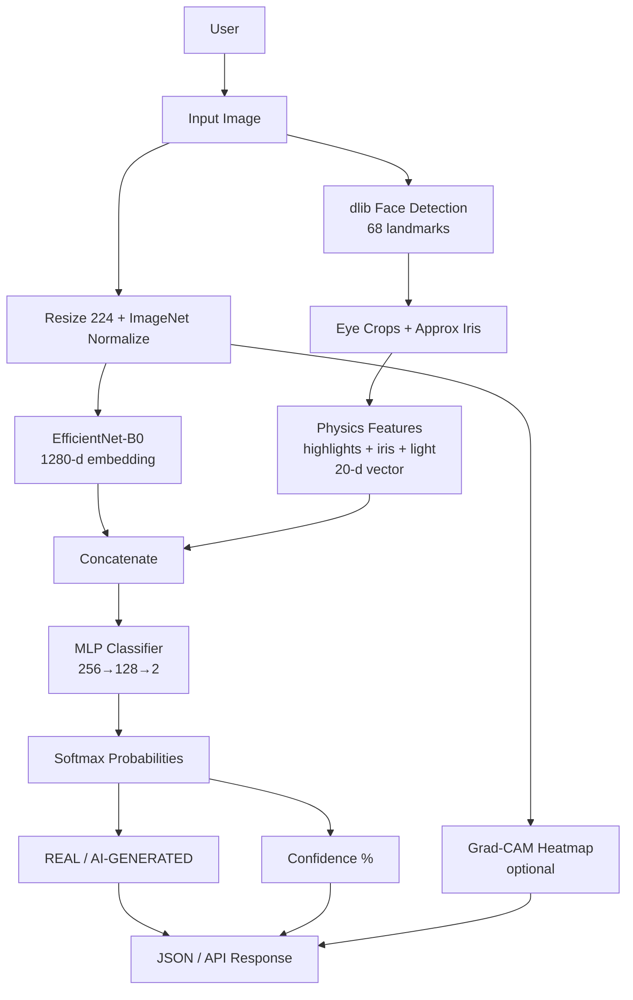

**Components NOT in actual implementation (omitted from diagram):**
- Fresnel equations
- MediaPipe
- Face crop for deep branch
- Attention fusion
- Shadow map analysis
- Config-based confidence thresholding
- CSV-driven data loading

---

## 28. "EXPLAIN THIS PROJECT TO ME" SECTION

### 30-second explanation

"We built a hybrid face authenticity detector. A pretrained EfficientNet looks at the whole image while a physics branch measures eye highlights, iris texture, and lighting consistency using dlib landmarks. We concatenate those features and train a classifier to distinguish real FFHQ portraits from AI-generated StyleGAN faces."

### 1-minute explanation

"The project solves detecting AI-generated portrait photos. It uses two complementary signals: deep learning captures subtle global texture patterns via EfficientNet-B0, and a physics-inspired branch extracts 20 handcrafted features from the eyes — corneal highlight symmetry, pupil shape, iris entropy, and light direction consistency. Training happens in two stages on Colab: first the CNN alone, then a hybrid model that fuses CNN embeddings with physics vectors through an MLP. Inference returns a label, confidence, and optional Grad-CAM heatmap. There's also a FastAPI service with PostgreSQL logging."

### 3-minute explanation

"Architecturally, `train.py` loads images from `data/real` and `data/fake` with a stratified 85/15 train-val split per data source. Stage 1 trains `DeepClassifier` — frozen early EfficientNet blocks plus a dropout linear head — using cross-entropy. Stage hybrid builds `HybridClassifier`: the same backbone produces a 1280-dimensional embedding, while `PhysicsFeatureExtractor` runs a four-step CV pipeline — dlib 68-point landmarks, OpenCV Hough-based corneal highlight detection with bilateral IoU, iris/pupil ellipse fitting with entropy, and highlight-derived light vector comparison. These 20 floats are concatenated with the deep embedding and classified by a two-hidden-layer MLP. Hybrid training warm-starts the backbone from Stage 1. Inference in `inference.py` mirrors training for hybrid checkpoints. The API wraps this with upload handling and stores results in PostgreSQL. Important caveats: Fresnel physics is naming only, iris landmarks are approximated, README still mentions MediaPipe but code uses dlib, and config thresholds aren't wired through. The repo contains no dataset or checkpoints — those come from Colab notebooks."

### Viva questions (30+)

**Q1: Why EfficientNet?**  
A: The code uses `efficientnet_b0` via timm as a efficient pretrained backbone with 1280-d features. No ablation vs ResNet exists in the repo — it was chosen as a practical Colab-friendly default.

**Q2: Why not ResNet?**  
A: Not implemented. `--backbone` accepts any timm name, but the project only documents and tests EfficientNet-B0.

**Q3: Why use a physics branch?**  
A: To inject interpretable eye/reflection features motivated by GAN inconsistency literature (README cites Hu et al. 2021), complementing texture learning in the CNN.

**Q4: What is the physics branch detecting?**  
A: Highlight symmetry, pupil eccentricity, iris texture entropy, and inter-eye lighting direction consistency — all via heuristics, not physical simulation.

**Q5: What is corneal reflection?**  
A: The bright specular spot on the eye surface from light reflection. The code detects it with image processing (Canny + Hough circles).

**Q6: What is Fresnel reflection?**  
A: A physics model of how light reflectance depends on angle and refractive indices. **Not implemented here.**

**Q7: Is Fresnel reflection actually implemented?**  
A: **No.** Only specular highlight heuristics are implemented.

**Q8: Why compare both eyes?**  
A: `analyze_corneal_reflections` flips the right highlight mask and computes IoU; `analyze_shadow_geometry` compares light vectors — bilateral symmetry checks.

**Q9: What is iris entropy?**  
A: Shannon entropy of grayscale histogram inside the approximated iris mask — higher values mean more texture variation.

**Q10: What is pupil eccentricity?**  
A: Eccentricity of an ellipse fit to the estimated pupil boundary: 0 = circle, approaching 1 = highly elongated.

**Q11: Why use StyleGAN2?**  
A: Phase 1 notebook downloads `hyperclaw79/fakefaces` StyleGAN2 images as the negative class for initial pipeline validation.

**Q12: Limitations of StyleGAN-only training?**  
A: Model may learn StyleGAN-specific artifacts and fail on diffusion-generated faces; diffusion folder is planned but not populated.

**Q13: Why hybrid fusion?**  
A: Combines learned representations with handcrafted forensic features; `FeatureFusion` concatenates both before the MLP.

**Q14: How are features combined?**  
A: Simple concatenation: 1280 + 20 = 1300 dimensions.

**Q15: How is the model trained?**  
A: `python src/train.py --mode stage1` then `--mode hybrid` on GPU with AdamW, cosine LR schedule, cross-entropy.

**Q16: How is validation performed?**  
A: 15% stratified holdout per (label, source); accuracy and loss computed each epoch; best checkpoint by val accuracy.

**Q17: What is overfitting?**  
A: Model memorizes training data and fails to generalize — a risk with small datasets and high-capacity networks.

**Q18: Why could 100% val accuracy be suspicious?**  
A: Small validation set, easy generator artifacts, or data leakage — the project doesn't implement rigorous forensic validation.

**Q19: What happens when no face is detected?**  
A: `face_detected=0`, other physics features default to zeros/sentinels; inference still runs.

**Q20: What if physics extraction fails?**  
A: Sub-modules return empty detections with zeros; no exception at top level.

**Q21: Why dlib instead of MediaPipe?**  
A: MediaPipe caused TFLite/XNNPACK threading deadlock during hybrid training; dlib replaced it (commit history: "replaced mediapipe with dlib").

**Q22: What is Grad-CAM?**  
A: Gradient-weighted class activation mapping — highlights image regions influencing CNN output. Implemented in `gradcam.py` using `pytorch_grad_cam`.

**Q23: How explain hybrid predictions?**  
A: Grad-CAM shows deep branch focus (with zero physics during CAM); physics features can be inspected via `debug_physics.py` report — no unified explainability.

**Q24: What are main limitations?**  
A: No dataset/weights in repo, approximated iris, no Fresnel physics, StyleGAN bias, config not fully wired, CPU physics bottleneck.

**Q25: How improve the system?**  
A: Add diffusion data, wire config thresholds, normalize physics features, face alignment, cache models in API, implement test evaluation, install dlib in requirements.

**Q26: What is Stage 2?**  
A: **Does not exist** in code. README jumps from Stage 1 to Stage 3 (hybrid).

**Q27: Are CSV splits used?**  
A: **No.** `train.py` creates its own split.

**Q28: What image size does the model use?**  
A: 224×224 RGB, ImageNet normalized.

**Q29: How many physics features?**  
A: 20 (`PHYSICS_FEATURE_DIM`).

**Q30: Is the physics branch differentiable?**  
A: **No.** Physics is computed with OpenCV/dlib/skimage outside PyTorch autograd.

**Q31: What database is used?**  
A: PostgreSQL with a single `predictions` table.

**Q32: Can you train on a laptop?**  
A: Code explicitly discourages it; `--allow-cpu` exists for smoke tests only.

---

## 29. "IF I NEED TO MODIFY THIS PROJECT" SECTION

| Goal | File → Location | What to change |
|------|-----------------|----------------|
| Change CNN backbone | `src/train.py` → `--backbone` CLI; `src/deep_branch/feature_extractor.py` → `model_name` | timm model string; verify `embedding_dim` |
| Change image size | `src/deep_branch/preprocessing.py` → `DEFAULT_IMAGE_SIZE`, `PreprocessConfig.image_size` | Resize and retrain required |
| Add another AI generator dataset | `data/fake/new_generator/` + `train.py` `FaceBinaryDataset` | Images auto-discovered via `rglob`; source tag from subfolder name |
| Add physics feature | `feature_vector.py` → `PHYSICS_FEATURE_NAMES` + `extract_from_landmarks` | Implement in B2/B3/B4 module; update `PHYSICS_FEATURE_DIM`; **retrain hybrid** |
| Remove physics feature | `feature_vector.py` | Remove from names list and values; retrain |
| Change classifier | `src/classifier/head.py` → `ClassificationHead` | Modify `hidden_dims`, layers |
| Change fusion strategy | `src/fusion/fuse.py` → `FeatureFusion.fuse` | e.g. attention — update `output_dim` in `HybridClassifier` |
| Change training params | `src/train.py` → `parse_args` defaults or CLI | lr, epochs, batch size, etc. |
| Change prediction threshold | `src/inference.py` → `predict()` | **Must implement** — config field exists but unused |
| Add API endpoint | `src/api/routes.py` + `schemas.py` | New route + schema |
| Change output format | `src/inference.py`, `src/api/schemas.py` | Modify `predict()` return dict |
| Add authentication | `src/api/main.py` or routes | FastAPI dependencies — **not present** |
| Add database storage | Already exists — extend `src/db/models.py` + `crud.py` | New tables/fields |
| Add explainability | `src/explain/gradcam.py` | Extend CAM or add physics feature attribution |
| Add another model | New class in `classifier/head.py` + `inference.py` `load_model` | New architecture + checkpoint `mode` |
| Wire config thresholds | `corneal_reflection.py`, `shadow_geometry.py`, `inference.py` | Pass `get_config()` values instead of hardcoded defaults |
| Fix landmark detector | `src/physics_branch/region_detection.py` | Replace dlib or restore MediaPipe |
| Update requirements | `requirements-local.txt` | Add `dlib`, `tqdm`; remove unused `mediapipe` if desired |

---

## 30. CODE DEPENDENCY GRAPH

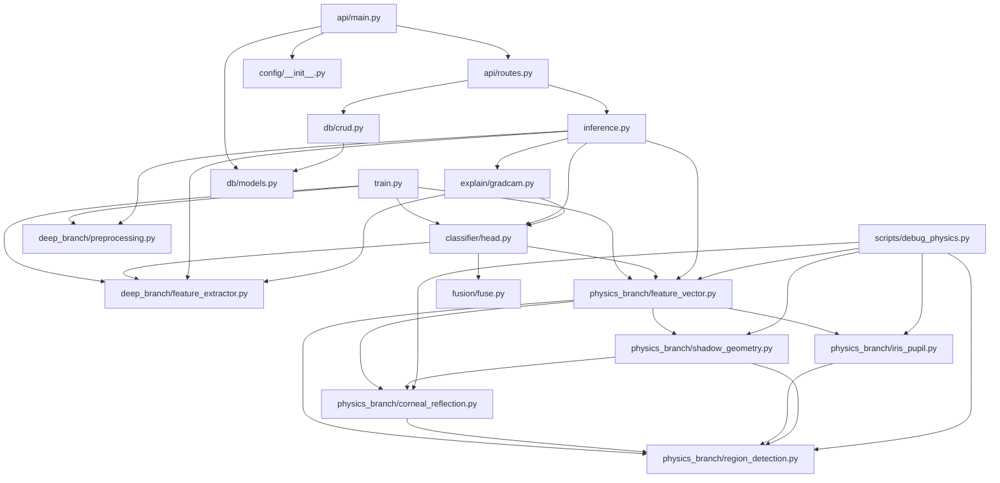

---

## 31. FINAL PROJECT STATUS

### Implemented
- Stage 1 deep classifier training (`DeepClassifier`)
- Hybrid training with physics features (`HybridClassifier`)
- EfficientNet-B0 backbone via timm with block freezing
- Physics pipeline B1–B4 with 20-feature vector
- dlib 68-point landmark detection (current)
- Corneal highlight heuristics + IoU
- Iris entropy + pupil ellipse fitting
- Light direction consistency check
- Single-image inference CLI
- Grad-CAM explainability (deep branch focus)
- FastAPI REST API + static dashboard
- PostgreSQL prediction logging
- Docker Compose deployment
- Unit tests for preprocessing, fusion, physics primitives
- Colab notebooks for data prep and training
- Debug physics visualization script

### Partially implemented
- Two-phase dataset strategy (diffusion folder created, download not done)
- Config system (YAML loaded but physics/inference thresholds not wired)
- README architecture description (still references MediaPipe)
- Corneal "Fresnel" analysis (conceptual naming only)
- Shadow geometry (highlight-based only, no shadows)
- Stage 1 → hybrid warm-start (backbone only, not classifier)
- Alerts config (`alerts.enabled: false`, no alert code)

### Unused / legacy
- MediaPipe (removed from src; still in requirements/README/notebook)
- `_normalize_highlight_mask()` in `corneal_reflection.py`
- `intensity_percentile` param in `detect_specular_highlight` (unused)
- CSV split files from notebook (not consumed by `train.py`)
- `1.4.0` pip log file at project root
- `DATABASE_URL` docker env var (app uses config.yaml)
- `log_prediction()` not called from API routes

### Known issues
- **dlib not in requirements** — physics breaks on fresh install
- **tqdm not in requirements** — hybrid training import fails on fresh install
- **RGB/BGR double conversion** risk in `preprocess_numpy` for RGB inputs
- **debug_physics.py** passes BGR to detector without RGB conversion
- **kaggle.json credentials** committed to repository
- No test set evaluation
- Physics computed synchronously on CPU during training — performance bottleneck

### Potential bugs
- Channel swap in training/inference preprocess path (RGB treated as BGR in `_ensure_rgb_uint8`)
- Test requires mediapipe skip but code needs dlib
- Docker may fail physics inference without dlib in Dockerfile dependencies

### Recommended improvements
1. Add `dlib` and `tqdm` to `requirements-local.txt`; remove or optionalize `mediapipe`
2. Fix RGB/BGR handling in `FacePreprocessor._ensure_rgb_uint8`
3. Wire `config.yaml` physics thresholds into analysis functions
4. Implement or remove unused `confidence_threshold` at inference
5. Cache loaded model in API instead of per-request reload
6. Consume CSV splits OR remove notebook split generation
7. Add `dlib` to Dockerfile and Colab pip cell
8. Remove `kaggle.json` from repo; rotate exposed API key
9. Add face detection/crop before deep branch resize
10. Normalize physics features before fusion
11. Add test-set evaluation script
12. Download and integrate diffusion face dataset (Phase 2)

---

*End of documentation.*
